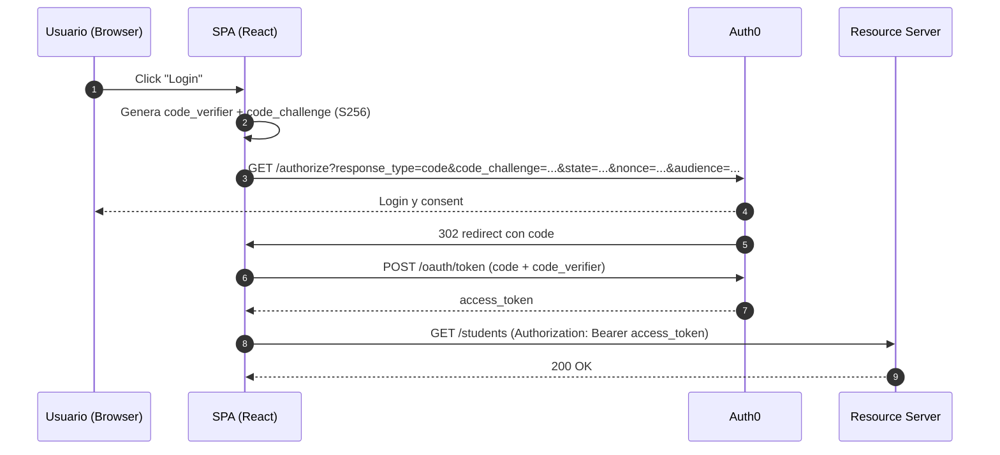

# Authorization Code + PKCE (SPA)

## Objetivo

Demostrar el flujo Authorization Code + PKCE para aplicaciones públicas (SPAs). PKCE protege el intercambio de código en clientes que no pueden guardar un client_secret.

## Diagrama de secuencia



## Cómo se ejecuta

1. Copiar `.env.example` en `backend/` y `frontend/` y completar las variables.
2. Instalar dependencias y arrancar:

```bash
cd authorization-code-pkce/backend
cp .env.example .env
npm install
npm run dev  # backend en http://localhost:4001

cd ../frontend
cp .env.example .env
npm install
npm run dev  # frontend en http://localhost:5173
```

## Teoría

## Teoría

### ¿Qué es PKCE y por qué es necesario?

**PKCE (RFC 7636)** significa "Proof Key for Code Exchange" y fue diseñado específicamente para **clientes públicos** (SPAs, aplicaciones móviles) que no pueden almacenar secretos de forma segura.

**El problema que resuelve:**
- Las SPAs ejecutan en navegadores donde cualquier código es visible al usuario
- `client_secret` no puede protegerse en JavaScript
- Sin PKCE, un atacante podría interceptar el authorization code y usarlo

### Mecánica Criptográfica de PKCE

**Code Verifier y Code Challenge:**
1. **Code Verifier**: String aleatorio de 43-128 caracteres (base64url)
2. **Code Challenge**: SHA256 hash del code verifier, codificado en base64url
3. **Code Challenge Method**: Especifica el método de hashing (S256 recomendado)

**Flujo de validación:**
- El authorization server almacena el code challenge con el authorization code
- Al intercambiar el code por tokens, el cliente debe proveer el code verifier original
- El servidor verifica: `base64url(sha256(code_verifier)) === code_challenge`

### SPAs vs Aplicaciones Tradicionales

**Características únicas de SPAs:**
- **Cliente público**: No puede mantener credenciales secretas
- **Cross-origin requests**: Requiere manejo cuidadoso de CORS
- **Token storage**: Los tokens deben almacenarse en el navegador (riesgos XSS)
- **No server-side session**: Toda la lógica de autenticación ocurre en el frontend

**Ventajas de PKCE sobre Implicit Flow:**
- **Authorization code**: Más seguro que tokens en URL fragments
- **Extensibilidad**: Soporte para refresh tokens (imposible con Implicit)
- **Consistency**: Mismo flujo base que aplicaciones confidenciales

### Gestión de Tokens en el Frontend

**Almacenamiento seguro:**
- **Memory storage**: Más seguro pero se pierde al refrescar
- **SessionStorage**: Limitado a la pestaña actual
- **LocalStorage**: Persistente pero vulnerable a XSS

**Protecciones recomendadas:**
- Content Security Policy (CSP) estricta
- Subresource Integrity (SRI) para librerías externas
- Token rotation automática con refresh tokens

### Validación de ID Tokens

**Verificaciones específicas para SPAs:**
1. **At_hash**: Verificar que el access token corresponde al ID token
2. **Nonce**: Prevenir ataques de replay vinculando a la sesión
3. **Azp (authorized party)**: Para escenarios multi-cliente
4. **Acr/Amr**: Verificar nivel de autenticación requerido

### Configuración de Auth0 para SPAs

**Application Type**: Single Page Application
- Deshabilita client_secret (no necesario con PKCE)
- Habilita PKCE automáticamente
- Configura allowed callback/logout URLs

**Token settings:**
- **RS256**: Algoritmo de firma obligatorio para SPAs
- **Access token lifetime**: Reducido (ej: 15 minutos)
- **Refresh token rotation**: Habilitar para máxima seguridad

### Consideraciones de Red y Performance

**CORS (Cross-Origin Resource Sharing):**
- Auth0 maneja CORS automáticamente para endpoints de autenticación
- APIs propias deben configurar CORS para permitir el dominio de la SPA

**Optimizaciones:**
- Usar silent authentication para renovar tokens sin interacción del usuario
- Implementar token caching para evitar verificaciones innecesarias
- Prefetch de JWKS para acelerar validación de tokens

## Pasos en Auth0

1. Crear API con scope `read:students`.
2. Crear Application tipo Single Page Application y configurar Allowed Callback/Origins.
3. Usar el audience correcto en la petición de autorización.

Pasos en Auth0 (resumen)

1. Crear API con scope `read:students`.
2. Crear Application tipo Single Page Application y configurar Allowed Callback/Origins.
3. Usar el audience correcto en la petición de autorización.
