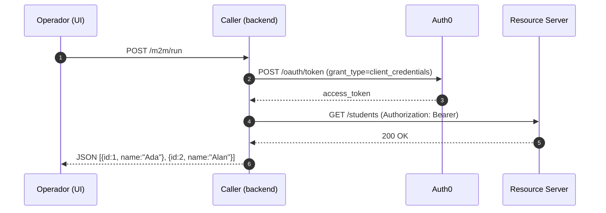

# Client Credentials (Machine-to-Machine)

## Objetivo

Demostrar el flujo Machine-to-Machine (client_credentials) donde una aplicación confidencial obtiene un access token usando client_id/client_secret y lo utiliza para llamar a una API protegida.

## Diagrama de secuencia



## Cómo se ejecuta

1. Backend:

```bash
cd client-credentials/backend
cp .env.example .env   # completar AUTH0_*, FRONTEND_ORIGIN
npm install
npm run dev            # caller en :4004, RS en :4006
```

2. Frontend (opcional operador):

```bash
cd client-credentials/frontend
cp .env.example .env
npm install
npm run dev            # Vite en http://localhost:5176
```

## Teoría

## Teoría

### Fundamentos del Client Credentials Flow

El **Client Credentials Grant** (RFC 6749) está diseñado exclusivamente para **comunicación máquina-a-máquina (M2M)**, donde no hay un usuario final involucrado. Es la base de las arquitecturas de microservicios modernas.

**Características distintivas:**
- **No user context**: El token representa la identidad del servicio, no de un usuario
- **Service authentication**: Solo `client_id` y `client_secret` son necesarios
- **Direct token request**: Un solo paso, sin redirects ni códigos intermedios
- **Scopes define permissions**: Los permisos se otorgan al nivel de aplicación, no de usuario

### Casos de Uso Principales

**1. Microservicios Communication**
- Service A necesita datos de Service B
- APIs internas que requieren autenticación
- Event processing entre servicios

**2. Scheduled Jobs & Background Tasks**
- Procesos batch que acceden a APIs
- Sincronización de datos entre sistemas
- Monitoring y reporting automatizado

**3. CI/CD & DevOps**
- Deployment pipelines que llaman APIs
- Infrastructure as Code (IaC) que configura servicios
- Automated testing que requiere API access

### Arquitectura de Seguridad

**Client Authentication Methods:**
- **Client Secret Basic**: Credenciales en Authorization header (Base64)
- **Client Secret Post**: Credenciales en el body de la request
- **Private Key JWT**: Firmado con clave privada del cliente (más seguro)
- **Client Secret JWT**: HMAC con shared secret

### Gestión de Scopes en M2M

**Principio de Least Privilege:**
- Cada servicio debe tener solo los scopes mínimos necesarios
- Scopes granulares por operación (read:users, write:orders, etc.)
- Revisión periódica de permisos otorgados

**Scopes vs Claims:**
- **Scopes**: Definen QUÉ puede hacer el cliente
- **Claims**: Definen metadatos adicionales sobre el cliente
- **Custom claims**: Información específica del dominio (tenant_id, region, etc.)

### Implementación de Resource Server

**Validación de Access Tokens:**
```
1. Verificar firma JWT (RS256 con clave pública del proveedor)
2. Validar issuer (iss) - debe ser tu Auth0 domain
3. Validar audience (aud) - debe ser el identifier de tu API
4. Verificar expiration (exp) - rechazar tokens vencidos
5. Validar scopes - confirmar permisos para el endpoint solicitado
6. Extraer client_id del token para logging/auditoría
```

**Headers de seguridad recomendados:**
- Authorization: Bearer {access_token}
- Content-Type: application/json
- User-Agent: {service-name}/{version}

### Configuración en Auth0

**Machine to Machine Application:**
- **Type**: Machine to Machine
- **Algorithm**: RS256 (nunca HS256 para M2M)
- **Token Lifetime**: Configurable según necesidades (típicamente 24h)

**API Configuration:**
- **Identifier**: URL única que representa tu API
- **Signing Algorithm**: RS256
- **Scopes**: Definir todas las operaciones disponibles
- **RBAC**: Habilitar para asignación granular de permisos

### Consideraciones de Producción

**Secret Management:**
- **Nunca hardcodear** client_secret en código
- Usar environment variables o secret managers (AWS Secrets, Azure KeyVault, etc.)
- Rotación periódica de secretos
- Diferentes secretos por ambiente (dev/staging/prod)

**Token Caching:**
- Implementar cache de tokens hasta su expiración
- Renovación automática antes del vencimiento
- Manejo de rate limits del proveedor de identidad

**Monitoring y Observabilidad:**
- Log de todas las solicitudes de tokens
- Métricas de latencia y tasa de éxito
- Alertas por fallos de autenticación
- Auditoría de uso de scopes

### Patrones de Implementación

**Token Caching Pattern:**
```
1. Check if cached token exists and is valid
2. If not, request new token from Auth0
3. Cache token with expiration buffer (ej: exp - 5 minutes)
4. Use cached token for API calls
5. Handle 401 responses by refreshing token
```

**Circuit Breaker Pattern:**
- Implementar circuit breaker para llamadas al authorization server
- Fallback strategies cuando Auth0 no está disponible
- Graceful degradation de funcionalidad

**Retry Logic:**
- Exponential backoff para fallos temporales
- Diferentes estrategias para errores 4xx vs 5xx
- Maximum retry limits para evitar loops infinitos

## Pasos en Auth0

1. Crear una API (audience) p.ej. `https://students-api` y añadir scope `read:students`.
2. Crear una Machine-to-Machine Application y autorizarla para la API con el scope `read:students`.
3. Copiar `client_id` y `client_secret` al `.env` del `client-credentials/backend`.

## Notas

- En este laboratorio el frontend no recibe ni almacena tokens: sólo invoca al caller.
- Para pruebas E2E necesitas configurar un tenant Auth0 o simular JWKS/local tokens.
