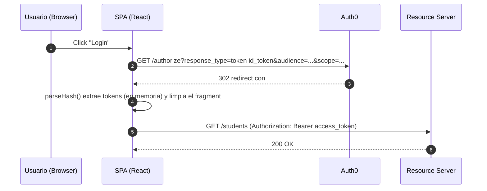

# Implicit Flow (educativo)

## Objetivo

Mostrar el flujo Implicit (legacy) con fines didácticos y para comparación con PKCE. No se recomienda su uso en producción.

## Diagrama de secuencia



## Cómo se ejecuta

1. Copiar `.env.example` a `.env` tanto en `backend/` como en `frontend/`.
2. Instalar dependencias e iniciar:

```bash
cd implicit/backend
cp .env.example .env
npm install
npm run dev  # backend en http://localhost:4002

cd ../frontend
cp .env.example .env
npm install
npm run dev  # frontend en http://localhost:5174
```

## Teoría

### Historia y Contexto del Implicit Flow

El **Implicit Grant** (RFC 6749) fue diseñado en 2012 para SPAs cuando CORS era limitado y las técnicas modernas de seguridad no existían. En 2019, la **RFC 8252** y las **OAuth 2.0 Security Best Practices** recomendaron **discontinuar su uso**.

**¿Por qué se creó inicialmente?**
- Las SPAs no podían realizar requests a authorization servers due to CORS limitations
- PKCE aún no existía como estándar
- Era la única opción viable para clientes públicos en navegadores

### Vulnerabilidades Fundamentales

**1. Tokens en URL Fragment**
- Los access tokens aparecen en la URL después del `#`
- Vulnerable a **history attacks** y **referrer leakage**
- Los tokens pueden quedar en logs de servidores, browser history, etc.

**2. No Authentication del Cliente**
- Sin `client_secret`, cualquiera puede impersonar la aplicación
- Sin PKCE, no hay "proof of possession" del authorization request

**3. Limitaciones de Seguridad**
- **No refresh tokens**: Por diseño de seguridad, complicando UX
- **Token lifetime corto**: Requiere re-autenticación frecuente
- **XSS vulnerability**: Tokens expuestos en JavaScript sin protección adicional

### Comparación con Alternativas Modernas

| Aspecto | Implicit Flow | Authorization Code + PKCE |
|---------|---------------|---------------------------|
| **Seguridad** | ❌ Tokens en URL | ✅ Tokens via backend channel |
| **PKCE** | ❌ No disponible | ✅ Protección criptográfica |
| **Refresh tokens** | ❌ No recomendado | ✅ Rotación segura |
| **Token exposure** | ❌ Browser history/logs | ✅ Solo en memoria/storage |
| **Standards compliance** | ❌ Deprecado (RFC 8252) | ✅ Current best practice |

### Mecánica Técnica (Solo para Comprensión)

**Request Flow:**
```
1. User → Authorization Server: 
   /authorize?response_type=token&client_id=...&redirect_uri=...&scope=...

2. Authorization Server → Browser:
   HTTP 302 redirect to: 
   callback#access_token=xxx&token_type=Bearer&expires_in=3600

3. JavaScript extrae tokens del fragment:
   const fragment = window.location.hash.substring(1);
   const params = new URLSearchParams(fragment);
   const accessToken = params.get('access_token');
```

### Implementación Segura (Si es Inevitable)

**Mitigaciones mínimas:**
- **Immediate fragment clearing**: `history.replaceState()` inmediatamente
- **In-memory storage**: Nunca persistir tokens en localStorage
- **CSP headers**: Content Security Policy estricta
- **Short token lifetime**: Máximo 15-30 minutos
- **HTTPS only**: Sin excepções, incluso en development

### Migración a Authorization Code + PKCE

**Pasos de migración:**
1. **Preparación**: Implementar Auth0 SPA SDK que soporta PKCE
2. **Configuration**: Cambiar Application Type a "Single Page Application"
3. **Code update**: Reemplazar implicit flow logic con PKCE
4. **Testing**: Verificar que refresh tokens funcionan correctamente
5. **Deployment**: Gradual rollout con feature flags

**Beneficios post-migración:**
- Mejor UX con refresh tokens (menos re-autenticaciones)
- Mayor seguridad con PKCE protection
- Compliance con modern security standards
- Support para advanced features (MFA, step-up auth, etc.)

### Configuración Auth0 (Solo Educacional)

**⚠️ ADVERTENCIA**: Esta configuración es **SOLO para propósitos educativos**

**Application Settings:**
- Application Type: Single Page Application
- Advanced Settings → Grant Types: Habilitar "Implicit"
- Token Endpoint Authentication Method: None

**Security considerations:**
- Allowed Callback URLs: HTTPS only en producción
- Allowed Web Origins: Dominio específico, no wildcards
- Token settings: Minimal lifetime, RS256 algorithm

### Detección y Remediación

**Cómo identificar uso de Implicit Flow:**
- Buscar `response_type=token` en código
- Tokens en URL fragments durante authentication
- Ausencia de refresh token logic
- Direct `/authorize` calls sin backend involvement

**Indicadores de migración necesaria:**
- Usuarios reportando re-autenticaciones frecuentes
- Security audits flagging deprecated flows
- Compliance requirements (PCI DSS, SOC2, etc.)
- Plans para mobile app que requiere consistent auth experience

## Pasos en Auth0

1. Crear API y scope `read:students`.
2. Crear Application tipo SPA y (si aplica) habilitar Implicit grant en Advanced Settings.
3. Configurar callbacks/origins y usar el audience correcto.

