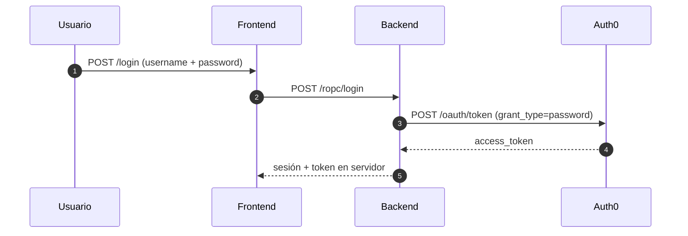

# Resource Owner Password Credentials (ROPC)

## Objetivo

Mostrar el flujo ROPC (Resource Owner Password Credentials) para clientes de alta confianza. Es un flujo legacy y no se recomienda para nuevas aplicaciones.

## Diagrama de secuencia



## Cómo se ejecuta

1. Backend

```bash
cd resource-owner-password/backend
cp .env.example .env
npm install
npm run dev
```

2. Frontend

```bash
cd resource-owner-password/frontend
cp .env.example .env
npm install
npm run dev
```

## Teoría

### Contexto Histórico y Propósito Original

El **Resource Owner Password Credentials Grant** (ROPC) fue incluido en OAuth 2.0 principalmente como **puente de migración** para sistemas legacy que no podían implementar flows basados en redirección.

**Casos originales de uso:**
- Migración de sistemas con autenticación básica HTTP
- Aplicaciones móviles nativas en ecosistemas cerrados
- Command-line tools y scripts automatizados
- Entornos donde redirección browser no es posible

### ¿Por qué está siendo Deprecado?

**Problemas fundamentales de seguridad:**

**1. Credenciales en el Cliente**
- La aplicación recibe y maneja directamente username/password
- Viola el principio fundamental de OAuth: **nunca compartir credenciales**
- Imposible distinguir entre cliente comprometido vs. credenciales robadas

**2. Falta de MFA y Conditional Access**
- No soporta autenticación multifactor nativa
- Imposible implementar conditional access (ubicación, device, riesgo)
- No compatible con políticas de seguridad modernas

**3. Ausencia de Consent y Transparency**
- Usuario no ve qué permisos otorga a la aplicación
- No hay opción de denegar acceso granular
- Falta audit trail de qué aplicación accedió a qué recursos

### Riesgos de Seguridad Específicos

**Credential Harvesting:**
- Aplicaciones maliciosas pueden capturar credenciales
- Phishing attacks dirigidos a credenciales "OAuth"
- Imposible detectar si el cliente está comprometido

**Password Policy Bypass:**
- Políticas de rotación de contraseñas pueden ser evadidas
- Contraseñas almacenadas por tiempo extendido en clientes
- Dificultad para enforcing password complexity

**Monitoring y Compliance:**
- Logs muestran autenticación exitosa, no qué aplicación la realizó
- Compliance frameworks (SOC2, GDPR) requieren granular consent
- Auditorías de seguridad flagean ROPC como high-risk

### Implementación Técnica (Solo para Migración)

**Request Format:**
```http
POST /oauth/token
Content-Type: application/x-www-form-urlencoded

grant_type=password
&username=user@example.com
&password=userpassword
&client_id=your_client_id
&scope=read:profile write:data
```

**Response:**
```json
{
  "access_token": "eyJ...",
  "token_type": "Bearer",
  "expires_in": 3600,
  "refresh_token": "def...",
  "scope": "read:profile write:data"
}
```

### Configuración Auth0 (Solo para Migración Legacy)

**⚠️ CRÍTICO**: ROPC está siendo **discontinuado por Auth0**

**Database Connection Requirements:**
- Solo funciona con Database connections
- No compatible con Social connections (Google, Facebook, etc.)
- No funciona con Enterprise connections (SAML, OIDC)

**Application Configuration:**
- Application Type: Native o Machine to Machine
- Advanced Settings → Grant Types: Habilitar "Password"
- Database Connection: Must allow ROPC grant

**Tenant Settings:**
- Algunas regiones/tenants ya tienen ROPC deshabilitado
- New tenants may not support ROPC at all
- Check Auth0 dashboard for deprecation warnings

### Estrategias de Migración

**Para Aplicaciones Móviles Nativas:**
```
ROPC → Authorization Code + PKCE
- Implementar browser-based auth con custom tabs/SFSafariViewController
- Usar Auth0 Mobile SDKs que manejan PKCE automáticamente
- Beneficios: MFA support, biometric auth, SSO entre apps
```

**Para Command Line Tools:**
```
ROPC → Device Authorization Grant
- User visita URL en browser para autorizar
- CLI polls authorization server hasta completar
- No requiere credenciales en la aplicación
```

**Para APIs Internas:**
```
ROPC → Client Credentials
- Si no hay user context real, usar M2M
- Mejor security model para service authentication
- Easier credential management y rotation
```

### Detección de Uso y Remediation

**Identificar uso de ROPC:**
- Buscar `grant_type=password` en logs de Auth0
- Code search para `/oauth/token` requests con password
- User complaints sobre "entering password in app"
- Security team flags durante auditorías

**Migration checklist:**
1. **Inventory**: Listar todas las apps usando ROPC
2. **Categorize**: Mobile vs CLI vs legacy web apps
3. **Plan**: Assign migration strategy per category
4. **Timeline**: Auth0 deprecation deadlines
5. **Testing**: Thorough testing of new flows
6. **Rollout**: Gradual migration con feature flags
7. **Cleanup**: Remove ROPC code y configuration

### Consideraciones de Compliance

**Frameworks que problematizan ROPC:**
- **PCI DSS**: Requires secure credential handling
- **SOC2**: Mandate granular access controls
- **GDPR**: Requires explicit, informed consent
- **NIST**: Recommends against password-based flows

**Documentation requirements:**
- Justificación business para continued use
- Risk assessment y mitigation plans
- Timeline para migration a secure alternatives
- User education sobre security implications

### Alternativas Recomendadas por Caso de Uso

| Caso de Uso | Alternativa Recomendada | Beneficios |
|-------------|------------------------|------------|
| **Mobile Apps** | Authorization Code + PKCE | MFA, biometrics, SSO |
| **CLI Tools** | Device Authorization Grant | No credentials in app |
| **Legacy Web** | Authorization Code (confidential) | Full security model |
| **M2M Services** | Client Credentials | Proper service auth |
| **IoT Devices** | Device Authorization Grant | User-controlled consent |

## Pasos en Auth0

1. Habilitar ROPC grant para la API y cliente (si está disponible en el tenant).
2. Crear Application tipo "Native" o "Single Page Application" y configurar credenciales.
3. Configurar la API para aceptar el flujo ROPC.

## Notas

- Mantener este escenario sólo con fines educativos y de migración.
- ROPC está siendo deprecado por Auth0 y otros proveedores de identidad.
